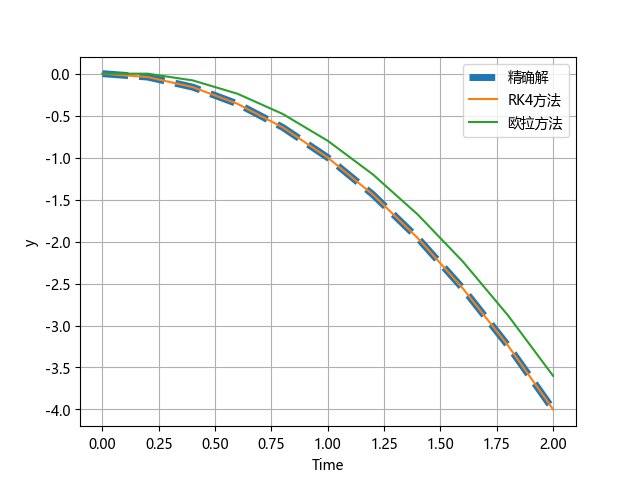
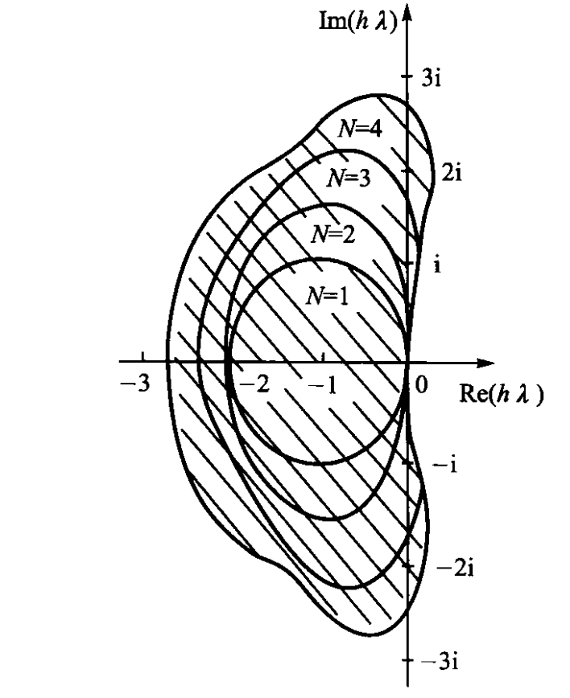

# ODE的IVP问题的数值解法

## 基本概念

**ODE：Ordinary Differential Equations 常微分方程**
**IVP: Initial Value Problem 初值问题**

对于一个ODE，有以下基本形式：

$$
\dot{y} = f(t,y), \quad t \in [t_0,T]
$$

可以看到，方程的变量$y$的变化率是和时间和方程本身相关的函数。对于上述ODE的初值问题IVP，即给定$t_0$时刻下的$y = y_0$，求解任意时刻$y$的值：

$$
\text{给定}t_0, y_0, \quad \text{求解} y(t)
$$

对于上述的IVP，若通过数值方法在时间节点$t_n$求解出一个$y_n$，同时ODE存在一个解析解$y(t)$，那么称$\epsilon_n$为**节点$t_n$的整体截断误差**:

$$
\epsilon_n=y(t_n)-y_n
$$

---

我本科一开始学习这个问题时难以理解这里的$f$和$y$之前的关系，因此我给定下面的一个例子，希望帮助理解没有接触过ODE的同学。

### ODE的IVP在航天中的应用

对于一个航天器具有质量$m$，绕质量为$M$的中心天体（地球，月球）飞行，忽略航天器的质量对地球轨迹的影响，那么航天器受到引力作用：

$$
\mathbf{F_g} = m\mathbf{a} = -\frac{GMm}{r^3}\mathbf{r}
$$

由于加速度$\mathbf{a}$实际上是位置矢量$\mathbb{r}$的二阶导数$\mathbf{a} = \ddot{\mathbf{r}}$，也是速度的一阶导数$\mathbf{a} = \dot{\mathbf{v}}$，上述可以写成一个二阶的微分方程：

$$
\ddot{\mathbf{r}} = -\frac{\mu}{r^3}\mathbf{r} = \dot{\mathbf{v}}, \quad \mu = GM=\text{常数}
$$

为了处理上述的这种二阶情况，可以定义一个状态以及状态的导数：

$$
\mathbf{x}=[\mathbf{r},\mathbf{v}]^T\\
\dot{\mathbf{x}}=[\dot{\mathbf{r}},\dot{\mathbf{v}}]=[\mathbf{v},\mathbf{a}]^T
$$

这样可以将上述的二阶ODE化简成为一组两个一阶ODE，而整个式子右边部分，即为微分方程$f(x)$:

$$
\begin{bmatrix}
    \dot{\mathbf{r}}\\
    \dot{\mathbf{v}}
\end{bmatrix} = \begin{bmatrix}
    \mathbf{v}\\
    -\frac{\mu}{r^3}\mathbf{r}
\end{bmatrix}
$$

注意到对于航天器而言，其位置和速度矢量是随着时间变化的，即$\mathbf{r}=\mathbf{r}(t),\mathbf{v}=\mathbf{v}(t)$因此上述式子可以更为广义的写成：

$$\dot{\mathbf{x}}(t)= \mathbf{f}(\mathbf{x},t)$$

其中微分方程的变量$\mathbf{x}$自身的变化率$\dot{\mathbf{x}}$和自身$\mathbf{x}$以及时间$t$相关。

对于上述的微分方程，若给定航天器初始观测时间的$t_0$和其状态向量$\mathbf{x}_0=[\mathbf{r}_0, \mathbf{v}_0]$，那么我们可以使用本章学习的经典方法（如龙格-库塔4次方法）进行航天器的轨道预报，这就是一个经典的IVP问题。

---

## 显式单步法

为了求解IVP，可以使用数值积分的方法，基本形式如下：

$$
y_{n+1}=y_n+h\phi(t_n,y_n,h)
$$

上述式子中$h$为**积分步长**，$\phi$称为**增量函数**。定义$R_{n+1}$为**节点$t_{n+1}$处的局部截断误差**：

$$
R_{n+1}=y(t_{n+1})-y_{n+1} =y(t_{n+1}) -y(t_n)-h\phi(t_n,y_n,h)
$$

若上述局部误差与$h^{p+1}$**同阶**（局部截断误差$R_{n+1}$与$h^{p+1}$的收敛速度或量级相同），即$R_{n+1}=O{(h^{p+1})}$，那么称单步法为$p$阶方法。

### 显性欧拉法

显性欧拉法是最基本的求解ODE的常见方法，其格式为：

$$
y_{n+1} = y_n + hf(t_n,y_n)
$$

然而其数值不太稳定，一般在工程中较少使用。

### 龙格-库塔RK方法

龙格库塔方法有以下的形式：

$$
\left\{
\begin{aligned}
y_{n+1} &= y_n + h\sum_{i=1}^{N} c_i k_i \\
k_1 &= f(t_n, y_n) \\
k_i &= f\left(t_n + a_i h, y_n + h\sum_{j=1}^{i-1} b_{ij} k_j\right) \quad (i = 2, 3, \cdots, N) \\
a_i &= \sum_{j=1}^{i-1} b_{ij} \quad (i = 2, 3, \cdots, N) \\
&(n = 0, 1, \cdots, M-1)
\end{aligned}
\right.
$$

其中$N$为RK方法的阶数，可以发现，$N=1$时，RK-1方法即为显性欧拉方法。工程中常用的方法为RK4与RK5方法，集成在许多通用计算软件的`ode45`中。

对于上述的两个方法，写了一个简单的示例代码在`ODE.py`中，求解一个简单的模型问题，其曲线如下，这里使用了10个区间，11个点：

## 收敛条件

### Lipschitz 条件

存在常数 $L≥0$（称为 Lipschitz 常数），对函数 $f (x)$ 定义域内任意两点 $x_1,x_2$，都满足:

$$
|f(x_1)-f(x_2)| ≤ L|x_1-x_2|
$$

**Lipschitz条件的直观意义：函数图像的任意割线斜率绝对值不超过 L，变化率有明确上界，不会出现 “突变”。**

### 三个定理

1. **整体局部误差关系**：对于单步法，若增量函数$\phi(t,y,h)$满足关于变量$y$的Lipschitz 条件，那么若局部截断误差有：$R_{n+1}=O{(h^{p+1})}$。整体截断误差有：$e_{n+1}=O{(h^{p})}$，比局部截断误差低1阶，这意味着整体误差的收敛速度比局部误差 “慢一阶”。
2. **相容性**：即当取步长$h$趋于零时，增量函数$\phi$的极限成为微分方程本身，就满足相容性。即满足：
   $$
   \lim_{h\rightarrow0}\phi(t,y,h)=\phi(t,y,0) = f(t,y)
   $$ 
   **满足相容性的充分必要条件为单步法至少是一阶方法。相容性条件本身又是IVP数值求解问题的必要条件。**
3. **收敛性**：若单步法得到的数值解和解析解在极限状态相同，即满足：
   $$
   \lim_{h\rightarrow0,t=t_n}y_n = y(t_n)
   $$
   那么称单步法是收敛的。满足收敛性的条件为上述的两个条件：**增量函数$\phi(t,y,h)$满足关于变量$y$的Lipschitz 条件**，以及**相容性条件**。

### 绝对稳定性

定义如下的模型方程：

$$
\dot{y}=\lambda y 
$$

若单步法对于上述ODE的IVP问题的初值有误差$e_0$,由此导致的误差$e_n$满足：

$$
\lim_{n\rightarrow\infty}e_n=0
$$

那么称单步法对步长$h$和复数$\lambda$是绝对稳定的。

**以欧拉法为例做推导：**

$$
y_{n+1}=y_n + h\lambda y_n = (1+h\lambda)y_n\\
e_{n} = (1+h\lambda)^n e_0
$$

因此绝对稳定需要满足：

$$
|1+h\lambda|<1
$$

即在复平面上以$-1$为圆心，1为半径的圆。

可以对各个方法推导并绘制出下面的图像：

不同阶数RK方法的稳定区间如下：

- RK-1 方法：(-2, 0)
- RK-2 方法：(-2, 0)
- RK-3 方法：(-2.51, 0)
- RK-4 方法：(-2.78, 0)