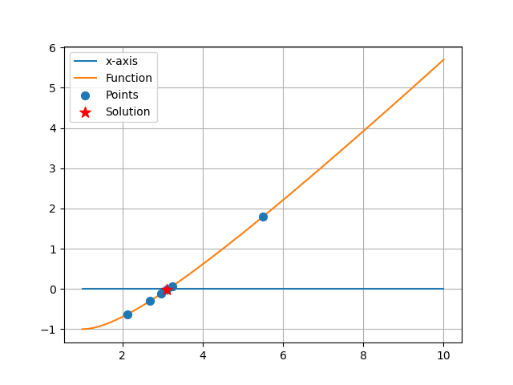
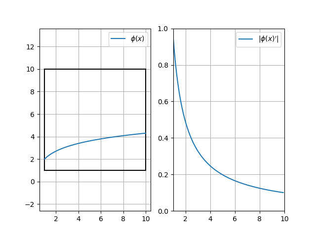
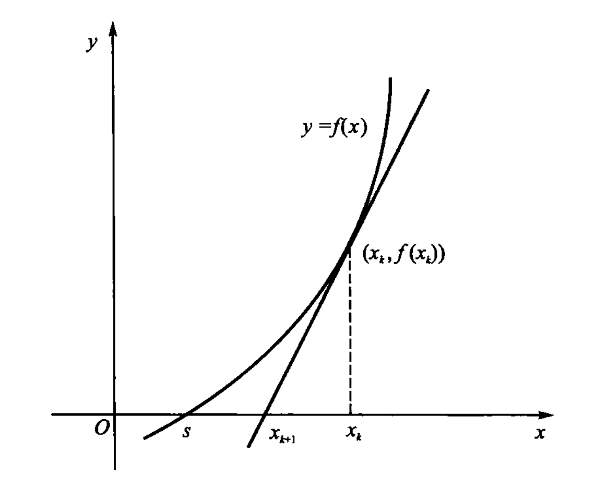
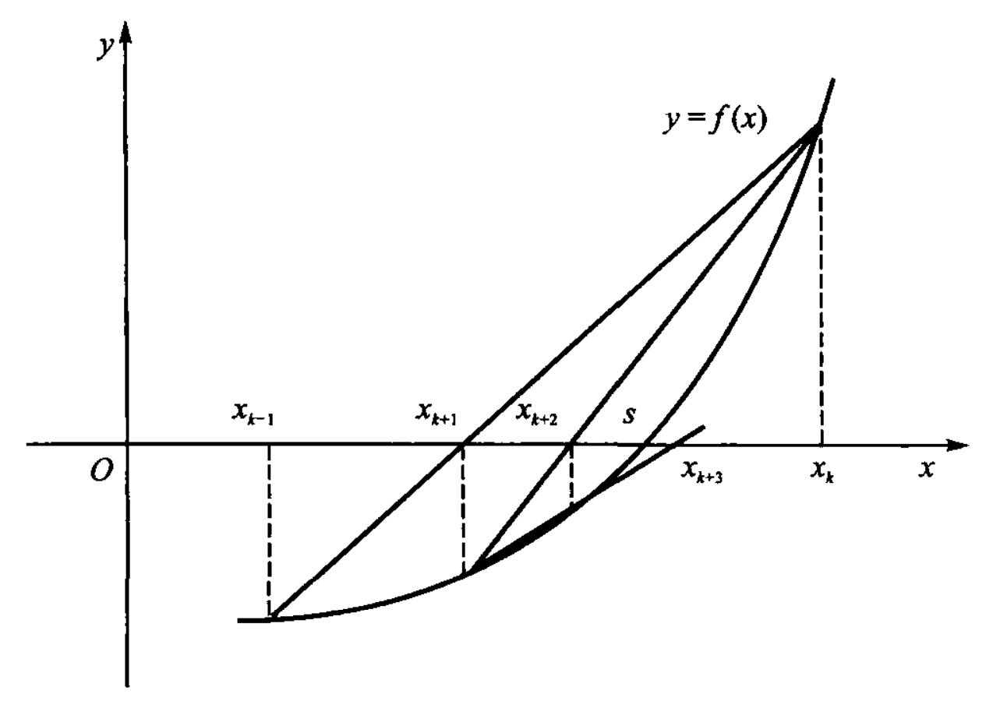
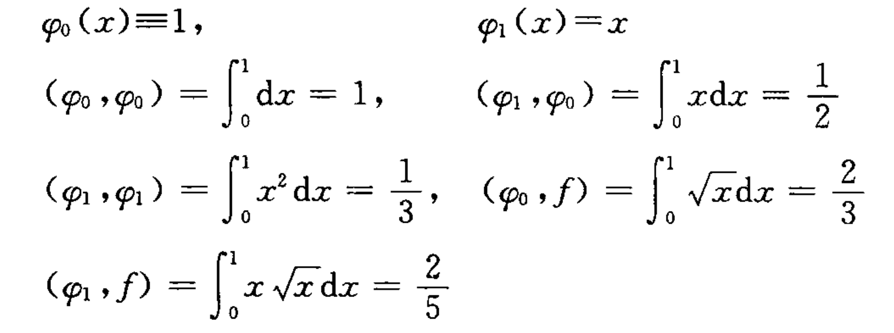
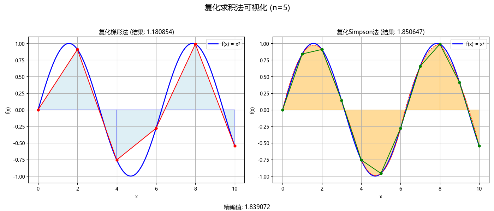

# 1. 绪论：误差与范数

## 误差
### 不同类型的误差

数值计算时，存在集中不同类型的误差：

- 模型误差：与实际不符
- 观测误差：测不准
- 截断误差：用例如**泰勒展开公式**拟合函数时产生的误差
- 舍入误差：计算机存储限制导致的误差

### 绝对误差、相对误差

关于误差这里有几个公式：
$$
e=x-a
$$

$$
|e|\le\epsilon
$$

$x$为**精确值**，$a$为**近似值**，$e$为**绝对误差**, $\epsilon$称为**绝对误差限**
此时可以表示精确值和近似值的不确定性：

$$
x = a\plusmn\epsilon
$$

绝对误差无法进行相互比较，这里引入相对误差的概念：

$$
e_r=\frac{e}{x}\approx\frac{e}{a}
$$

$$
|e_r|\le \epsilon_r = \frac{\epsilon}{|a|}
$$

$e_r$为**相对误差**，$\epsilon_r$为**相对误差限**

### 有效数字

一般给出一个**绝对误差限**$\epsilon$，以及某个**近似值**$a$，然后求$a$的有效数字。

这里有一个前提，**绝对误差限**$\epsilon$必须首先小于**近似值**$a$，否则有效数字为0,真正的实际数据被误差噪声所淹没。

给出一个例子：

$$a = 1.38 \\\epsilon = 0.005$$

此时看$\epsilon$与$a$的对齐的位，这里$a=1.38$这三位都是有效数字。

### 算法和计算复杂性

做数值计算时，需要避免这几个问题：

- 需要有数值稳定性
- 两数相加，需要避免较小的数无法加到较大的数
- 避免两个相近的数相减
- 除法运算中：$a/b$需要避免$|b|\ll|a|$

## 范数

范数的定义，满足下面三个条件，这里的$\mathbf{x}$与$\mathbf{y}$既可以是向量，也可以是矩阵

- 正定性：$||\mathbf{x}||\ge 0$，当且仅当 $\mathbf{x=0}$时, $||\mathbf{x}||= \mathbf{0}$
- 齐次性：$k\in \mathbb{R},||k\mathbf{x}||=|k|\cdot||\mathbf{x}||$
- 成立三角不等式：$||\mathbf{x+y}||\le ||\mathbf{x}||+||\mathbf{y}||$

存在向量范数与矩阵范数，都存在p范数：

### 向量范数

一范数：即向量的每个元素求绝对值后求和：

$$
||\mathbf{x}||_1=\Sigma|x_i|
$$

二范数：即向量的每个元素求平方相加后再开方：

$$
||\mathbf{x}||_2=\sqrt{\Sigma x_i^2}
$$

无穷范数：即直接取出向量每个元素的绝对值的最大：

$$
||\mathbf{x}||_\infty=\max|x_i|
$$

### 矩阵范数

一范数：即矩阵各**列元素**的绝对值之和的最大值，称为**列范数**：

$$
||\mathbf{A}||_1=\max_j\Sigma_i|a_{ij}|
$$

二范数：即矩阵$A^TA$的最大特征值，称为**谱范数**：

$$
||\mathbf{A}||_2=\sqrt{\lambda_{\text{max}}(A^TA)}
$$

无穷范数：即矩阵各**行元素**的绝对值之和的最大值，称为**行范数**:

$$
||\mathbf{A}||_\infty=\max_i\Sigma_j|a_{ij}|
$$

F范数：类似地对应了向量的二范数，矩阵的每个元素开方后求和：

$$
||\mathbf{A}||_\text{F}=\sqrt{\Sigma \Sigma a_{ij}^2}
$$

### 其他的一些概念：

向量与矩阵范数相容：

$$
||\mathbf{Ax}||\le||\mathbf{A}||\cdot||\mathbf{x}||
$$

范数为矩阵的算子范数：

$$
||\mathbf{A}||=\max_{||\mathbf{x}||=1}||\mathbf{Ax}||
$$

# 2. 线性方程组的解法

本章学习$\mathbf{Ax=b}$形式的线性方程组的求解方法。有两大类方法：**直接法**和**迭代法**。

## 直接法
直接法可以直接得到方程组的解，这类方法对于小型矩阵可以快速得到精确的解。这里介绍三类方法：**Cramer方法**、**高斯消去法**、**直接三角分解法**。

### Cramer方法

Cramer方法是最直接的线性方程组求解方法，但是效率非常低，不常用。

Cramer方法对上述方程的求解又如下公式：

$$
x_i = \frac{\Delta_i}{\det{\mathbf{A}}}
$$

其中$\Delta_i$是将$\mathbf{A}$矩阵的第$i$列替换为向量$\mathbf{b}$后得到的矩阵的行列式。

### 高斯Gauss消去法

高斯消元法是最为直接的求解方法，本质上为小学学习方程组时的基本换元方法的系统化体现。学习了**顺序消元法**和**列主元素消元法**两类，后者是在前者的基础上额外添加了一步的优化。两种方法的具体求解方法已经写入了`Gauss_Elimination.py`的文件中。B站[现代不抽象](https://www.bilibili.com/video/BV1uLo6Y5Eku/)的这个视频解释的很好。

本质上两种方法都首先构建了一个增广矩阵：

$$
[\mathbf{A,b}]=\begin{bmatrix}
    a_{11} & \cdots & a_{1n} & b_1 \\
    \vdots & \ddots & \vdots & \vdots  \\
    a_{n1} & \cdots & a_{nn} & b_n \\
\end{bmatrix}
$$

然后按照每行的顺序进行初等行变化，使得矩阵变为如下的形式：

$$
\begin{bmatrix}
    1 & \cdots & a_{1n}' & b_1' \\
     & \ddots & \vdots & \vdots   \\
    \mathbf{0} &  & 1 & b_n' \\
\end{bmatrix}
$$

然后将其反过来代回，变化成下面的矩阵，得到的即为向量$\mathbf{x}$的解：

$$
\begin{bmatrix}
    \mathbf{I}_{n\times n} & \mathbf{b'}_{n\times 1}
\end{bmatrix}
$$

列主元素消元法，是在初等行变化的基础上，加入一个判定和交换，使得当前行需要消解为1的列的元素是剩余所有行中最大的，执行代码后即可明白。

### 直接三角分解法

直接三角分解法包括**Doolittle**和**Crout**分解法两类，两个方法都将原先的线性方程组分解为以下形式：

$$
\mathbf{Ax=LUx=Ly=b}
$$

然后求解的时候，可以首先求解$\mathbf{y}$，然后求解$\mathbf{x}$。

在**Doolittle**分解时，$L$为单位下三角阵，$U$为上三角阵

$$
\mathbf{L}=\begin{bmatrix} 1 & 0 & 0 & \dots & 0 \\ l_{21} & 1 & 0 & \dots & 0 \\ l_{31} & l_{32} & 1 & \dots & 0 \\ \vdots & \vdots & \vdots & \ddots & 0 \\ l_{n1} & l_{n2} & l_{n3} & \dots & 1 \\
\end{bmatrix} \quad
\mathbf{U}=\begin{bmatrix} u_{11} & u_{12} & u_{13} & \dots & u_{1n} \\ 0 & u_{22} & u_{23} & \dots & u_{2n} \\ 0 & 0 & u_{33} & \dots & u_{3n} \\ \vdots & \vdots & \vdots & \ddots & \vdots \\ 0 & 0 & 0 & \dots & u_{nn} \\
\end{bmatrix}
$$

而在**Crout**分解时，则反过来，$L$为下三角阵，$U$为单位上三角阵

$$
\mathbf{L}=\begin{bmatrix} l_{11} & 0 & 0 & \dots & 0 \\ l_{21} & l_{22} & 0 & \dots & 0 \\ l_{31} & l_{32} & l_{33} & \dots & 0 \\ \vdots & \vdots & \vdots & \ddots & 0 \\ l_{n1} & l_{n2} & l_{n3} & \dots & l_{nn} \\
\end{bmatrix} \quad
\mathbf{U}=\begin{bmatrix} 1 & u_{12} & u_{13} & \dots & u_{1n} \\ 0 & 1 & u_{23} & \dots & u_{2n} \\ 0 & 0 & 1 & \dots & u_{3n} \\ \vdots & \vdots & \vdots & \ddots & \vdots \\ 0 & 0 & 0 & \dots & 1 \\
\end{bmatrix}
$$

**Doolittle 和 Crout 分解的充分必要条件都为$\mathbf{A}_{n\times n}$的前$n-1$个顺序主子式行列式不为零。**

对于Doolittle和Crout分解法，其元素的计算公式可以根据矩阵的形式反推得到，若有草稿纸的情况下可以手动对较小规模的矩阵手动分解。对于$\mathbf{L}$和$\mathbf{U}$的每个元素的计算，都是交替进行的。对于Doolittle方法，首先计算$\mathbf{U}$的第$n$行，然后计算$\mathbf{L}$的第$n$列，之后计算$\mathbf{U}$的第$n+1$行，以此类推；Crout方法则反过来。具体的代码求解已经写在`LU_Decomposition.py`的文件中，可以尝试运行试一试。

## 迭代法

前面介绍了求解线性方程组的直接方法，对于大型稀疏矩阵的运算，上述方法可能效率较低，因此引入迭代方法，通过多次计算，逐渐逼近方程组的解。同时现代计算GPU等支持并行计算，适配迭代方法的矩阵运算。

这里介绍了四种迭代方法：**简单迭代法**、**Jacobi迭代法**、**Gauss-Seidel迭代法**、以及**逐次超松弛SOR方法**。这几个方法的具体代码已经写在了`Iteration_Method.py`文件中。

### 简单迭代法

对于简单迭代法，可以将原方程组写成这样的形式：

$$
\mathbf{Ax=(N-P)x=b}\\
\mathbf{Nx=Px+b}\\
\quad\\
\mathbf{x=N^{-1}Px+N^{-1}b=Gx+d}
$$

这样可以写成迭代式，这即为简单迭代法。
$$
\mathbf{x}^{(k+1)}=\mathbf{Gx}^{(k)}+\mathbf{d}
$$

对于上述的简单迭代法的收敛条件，有两个判断定理：

1. 定义矩阵的谱半径$\rho(\mathbf{G})=\max|\lambda_i|$,即矩阵所有特征值的绝对值的最大，若$\rho(\mathbf{G})<1$，那么简单迭代法收敛。**这是简单迭代法收敛的充分必要条件**。
2. 若矩阵的某种范数$||\mathbf{G}||<1$，那么简单迭代法也必定收敛且唯一，且有两个误差估计式：
   $$
   ||\mathbf{x}^{(k)}-\mathbf{x}^*||\le \frac{||\mathbf{G}||^k}{1-||\mathbf{G}||}||\mathbf{x}^{(1)}-\mathbf{x}^{(0)}||
   $$
   $$
   ||\mathbf{x}^{(k)}-\mathbf{x}^*||\le \frac{||\mathbf{G}||}{1-||\mathbf{G}||}||\mathbf{x}^{(k)}-\mathbf{x}^{(k-1)}||
   $$

个人理解是第二个收敛条件从数学上证实了只要两次求解的解几乎没怎么发生变化，即$||\mathbf{x}^{(k)}-\mathbf{x}^{(k-1)}||$，那么就可以认为求解出来的解已经非常接近于真实的精确解$\mathbf{x}^*$，但是若$||\mathbf{G}||$很接近1,即使两次解非常接近也无法进行判定。

### Jacobi迭代法

在这个迭代法中，原矩阵拆分为了三部分，分别为对角阵和上下三角阵:
$$
\mathbf{A = D+L+U}
$$

若$4\times4$的情况，有这样的表示：

$$
\mathbf{D} = \begin{bmatrix}
    a_{11} & & & \\
    & a_{22} & & \\
    & & a_{33} & \\
    & & & a_{44}
\end{bmatrix}
$$

$$
\mathbf{L} = \begin{bmatrix}
    0 & & & \\
    a_{21} & 0 & & \\
    a_{31} & a_{32} & 0 & \\
    a_{41} & a_{42} & a_{43} & 0
\end{bmatrix}
\quad
\mathbf{U} = \begin{bmatrix}
    0 & a_{12} & a_{13} & a_{14} \\
    & 0 & a_{23} & a_{24} \\
    & & 0 & a_{34} \\
    & & & 0
\end{bmatrix}
$$
这样原来的迭代方法有：
$$
\mathbf{x}^{(k+1)}=\mathbf{G}_J\mathbf{x^{(k)}}+\mathbf{b}_J=[\mathbf{-D}^{-1}(\mathbf{L+U})]\mathbf{x^{(k)}}+[\mathbf{-D}^{-1}\mathbf{b}]
$$
对于Jacobi迭代法，形态也满足简单迭代法，但是这里有额外的一个收敛定理：

**若矩阵$\mathbf{A}$是按行/按列严格占优阵**（即其主对角线上的各个元素的绝对值都大于这一行/列上其他元素绝对值之和，即$|a_{ii}|>\Sigma_{i\ne j}|a_{ij}|$），**那么Jacobi迭代法必然收敛。**

### Gauss-Seidel迭代方法(GS方法)

Gauss-Seidel方法(GS方法)在原先Jacobi方法上做了一些调整，保持矩阵$\mathbf{D},\mathbf{L},\mathbf{U}$不变，调整迭代方法为：
$$
\mathbf{x}^{(k+1)}=\mathbf{G}_G\mathbf{x^{(k)}}+\mathbf{b}_G=[\mathbf{-(D+L)}^{-1}\mathbf{U}]\mathbf{x^{(k)}}+[\mathbf{(D+L)}^{-1}\mathbf{b}]
$$
此时增加一个判定收敛定理，**若系数矩阵$\mathbf{A}$为正定矩阵，那么GS方法必然收敛。**

### 逐次超松弛迭代法（SOR方法）

SOR方法在GS方法上引入了一个参数变量 $\omega$，此时迭代方法调整为：
$$
\mathbf{x}^{(k+1)}=\mathbf{G}_S\mathbf{x^{(k)}}+\mathbf{b}_S=\\\mathbf{-(\frac{1}{\omega}D+L)}^{-1}[(1-\frac{1}{\omega})\mathbf{D}-\mathbf{U}]\mathbf{x^{(k)}}+[\mathbf{(\frac{1}{\omega}D+L)}^{-1}\mathbf{b}]
$$

此时发现，若$\omega=1$时，SOR方法即为GS方法。
此时的判定收敛的定理中有，**若系数矩阵$\mathbf{A}$为正定矩阵，$0<\omega<2$，那么GS方法必然收敛。**

# 3. 矩阵特征值和特征向量计算

本章主要学习如何通过数值方法求解矩阵的特征值和特征向量，主要介绍了幂法和反幂法。对于矩阵特征值$\lambda$有：

$$
\mathbf{Ax}=\lambda\mathbf{x}
$$

## 幂法

对于矩阵$\mathbf{A}$，假设其存在$n$个特征值和对应的特征向量$\mathbf{x}_i$：

$$
|\lambda_1|>|\lambda_2|\ge \cdots \ge|\lambda_n|
$$

给定任意初始向量$\mathbf{u_0}$，能写成各个特征向量的线性组合：

$$
\mathbf{u_0}=a_1\mathbf{x}_1+a_2\mathbf{x}_2+\cdots+a_n\mathbf{x}_n
$$

那么给定下述迭代方程，展开可以发现：

$$
\mathbf{u}_k=\mathbf{Au}_{k-1}=\mathbf{A}^2\mathbf{u}_{k-2}=\cdots=\mathbf{A}^k\mathbf{u}_0\\
= \lambda_1^k [ a_1\mathbf{x}_1 + a_2 \left( \frac{\lambda_2}{\lambda_1} \right)^k \mathbf{x}_2 + a_3 \left( \frac{\lambda_3}{\lambda_1} \right)^k \mathbf{x}_3 + \cdots]\\
$$

在$k$足够大的情况下，$\lambda_2/\lambda_1$等项趋于零:

$$
\mathbf{u}_k\approx\lambda^k_1\alpha_1\mathbf{x}_1
$$

这样我们可以有基本的幂法迭代方法：

$$
\begin{aligned}
    \mathbf{y}_{k-1}&=\frac{\mathbf{u}_{k-1}}{||\mathbf{u}_{k-1}||}\\
    \mathbf{u}_k&=\mathbf{Ay}_{k-1}\\
    \beta_k&=\mathbf{y}_{k-1}^T\mathbf{u}_k
\end{aligned}
$$

其中$\beta_k$为当前求解迭代步解出的$\lambda_1$特征值，$\mathbf{y}_{k-1}$为解出的特征向量。

**幂法的迭代收敛速度取决于$|\frac{\lambda_{m}}{\lambda_1}|$的比值，这个比值越小，收敛速度越快。**

## 反幂法

矩阵非奇异的情况下有：

$$
\mathbf{Ax}_i=\lambda_i\mathbf{x}_i \rightarrow \mathbf{A}^{-1}\mathbf{x}=\frac{1}{\lambda_i}\mathbf{x}_i
$$

利用上式右侧的格式带入到幂法的迭代方程中，可以得到：

$$
\begin{aligned}
    \mathbf{y}_{k-1}&=\frac{\mathbf{u}_{k-1}}{||\mathbf{u}_{k-1}||}\\
    \mathbf{u}_k&=\mathbf{A}^{-1}\mathbf{y}_{k-1}\\
    \beta_k&=\mathbf{y}_{k-1}^T\mathbf{u}_k
\end{aligned}
$$

这即为反幂法，可以求解得到矩阵最小的特征值，注意若使用上述迭代方法，求解的特征值为$\lambda_i=1/\beta_k$。

上述的两个方法在实际的计算求解中发现了$\beta_k$在求解过程中可能最终和实际的特征值符号相反，和豆包沟通后发现可能需要用更可靠的 Rayleigh 商，即上述的迭代过程使用这个迭代方法，而且反幂求解的特征值无需再求倒数。

$$
\beta_k = \frac{\mathbf{y}_{k}\mathbf{Ay}_k^T}{\mathbf{y}_k\mathbf{y}_k^T}
$$

在实际过程中，可以采用原点平移的方法求解靠近某个p值的特征值，这是由于：

$$
\mathbf{Ax}=\lambda\mathbf{x} \\
(\mathbf{A}-p\mathbf{I})\mathbf{x}=(\lambda-p)\mathbf{x}
$$

这样，只需要将$\mathbf{A}-p\mathbf{I}$作为新的矩阵$\mathbf{A}$带入反幂法求解即可。

上述三种求解矩阵特征值和特征向量的方法写在了`Power_Method.py`中

# 4. 非线性方程组的迭代算法

本章主要学习如何通过数值方法求解下述非线性方程组：

$$
f(x)=(x-s)^m\phi(x)=0
$$

这里，$s$称为方程的$m$重根，对应的$x$为$m$重零点。

## 对分法

对分法的求解概念简单，若函数$f(x)\in [a,b]$上连续且发生变号，即$f(a)f(b)<0$，那么就证明函数在区间$(a,b)$间必然有一个根，那么我们可以通过不断求解区间的中点的方法，对比根在哪个子区间内完成求解。这一简单的方法示意如下，求解代码写在`Bisection.py`中。

  

需要注意的是，对分法在智能求解单根或者奇数重根，不能求解偶数重根（$y=x^2$仅碰到了$y=0$）和复数根。

## 简单迭代法

简单迭代法将原先的非线性方程表达为：

$$
x_{k+1} = \phi (x_{k})
$$

这样可以通过迭代求解；然而不同的非线性方程可以有不同的迭代公式，其最终是否能够收敛取决于$\phi(x)$本身。

### 收敛性判断

对于初始值$x_0\in[a,b]$，若简单迭代法收敛，那么必须满足以下两个条件：

- 自映射：当 $x\in[a,b],\phi(x)\in[a,b]$
- 压缩性：当 $x\in(a,b),|\phi(x)'|\le L< 1$，$L$为小于一的常数

其中第一个条件为收敛性提供了一个范围约束，第二个条件可以通过微分中值定理这样理解：

$$
|x_{k+1}-s|=|\phi(x_k)-\phi(s)|=|\phi'(\epsilon)|\cdot|x_k-s|\le L\cdot|x_k-s|
$$

相当于每次迭代的误差都会转变为原先误差的$L$倍，若保证误差逐渐变小，必须保证$L<1$

满足上述条件可以保证求解的序列收敛，并可以成立误差估计式：

- $$|s-x_k|\le\frac{L^k}{1-L}|x_1-x_0|$$
- $$|s-x_k|\le\frac{L}{1-L}|x_k-x_{k-1}|$$

在实际求解时，采用以下标准：

$$
\frac{|x_k-x_{k-1}|}{|x_k|}\le \eta
$$

上述简单迭代法的代码事件写在`Simple_Iter.py`中，其中也同步绘制了其两个收敛性的判断，其中第一个条件相当于$\phi(x)$必须包含在a,b构成的矩形区域内：

  

### 收敛速度

定义$e_k=s-x_k$,那么我们可以定义收敛因子$c$以及$r$阶收敛速度：

$$
\lim_{k\rightarrow\infty}\frac{|e_{k+1}|}{|e_{k}|^r}=c
$$

上述极限也可求解到某阶$k\ge K$时进行判断

- $r=1$，线性收敛，$0<c\le 1$
- $r=2$，平方收敛
- $r>1$，统称为超线性收敛

在先前的收敛性判断中，简单迭代法是线性收敛的，若能够满足以下条件：

- $\phi^{(i)}(s)=0, (i=1,2,\cdots ,m-1)$
- $\phi^{(m)}(s)\ne 0$

那么简单迭代法序列$m$阶收敛于$s$。

### Steffensen迭代法

Steffensen迭代法在简单迭代法的基础上做了些小改动，使其可以加速收敛：

由$x_k$,$x_{k+1}$,$x_{k+2}$三个迭代值，可通过微分中值定理得到：

$$
x_{k+1}-s = \phi'(\epsilon_k)(x_k-s) \\
x_{k+2}-s = \phi'(\epsilon_{k+1})(x_{k+1}-s) \\
$$

对上述式子进行变型：

$$
\frac{x_{k+1}-s}{x_k-s}\approx\frac{x_{k+2}-s}{x_{k+1}-s} \rightarrow s \approx x_k - \frac{(x_{k+1}-x_k)^2}{x_{k+2}-2x_{k+1}+x_k}
$$

这样我们就得到了Steffensen迭代法：

$$
x_{k+1} = x_k - \frac{(\phi(x_k)-x_k)^2}{\phi(\phi(x_k))-2\phi(x_k)+x_k}
$$

Steffensen迭代法二阶收敛于$s$。

上述的Steffensen和简单迭代法，都可以用于求解方程的**实数和复数根**。

## 牛顿法

牛顿法(Newton's Method)可求解非线性方程组的**实数和复数根**，也可以用于求解有$m$**重根**的情况。在求解实数根时，由于牛顿法具有强几何意义，其也称之为**切线法**。
 

牛顿法的基本迭代式如下：

$$
x_{k+1} = x_k - \frac{f(x_k)}{f'(x_k)}
$$

### 收敛性判断

存在小范围和大范围两个收敛定理。

对于**小范围收敛定理**：

 - $f''(x)$连续且$f'(x)\ne 0$，那么$x_0$在靠近$s$的某个范围内收敛于$s$。
 - $f''(x)\ne 0$，且$x_0\ne s$，则序列时平方收敛的。

对于**大范围收敛定理**：

 - $f(x)$在区间$(a,b)$内变号，即$f(a)f(b)<0$
 - 在区间内$f''(x)$不变号
 - 在区间内$f'(x)\ne 0$
 - $f(x_0)f''(x_0)>0$
 - 满足上述四个条件，那么牛顿法产生的序列**单调平方收敛**于$s$。

### 求解m重根的牛顿法

对于例如$f(x)=(x-2)^2$的函数，其有多重根，可以发现：

$$
f(s)=f'(s)=\cdots=f^{(m-1)}(s)=0
$$

通过求解极限证明发现，在这种情况下，牛顿法虽然收敛，但是收敛速度只是线性的。若已知方程的重根数$m$，使用以下迭代求解公式，收敛速度可以变为二阶：

$$
x_{k+1}=x_k-\frac{mf(x_k)}{f'(x_k)}
$$

一般情况下不知道重根数$m$，我们可以考虑求解方程$u(x)=0$，此时方程的解具有单重根：

$$
u(x)=\frac{f(x)}{f'(x)}
$$

此时求解上述方程的牛顿迭代法最终可以整理为下述形式，并具有二阶收敛速度：

$$
x_{k+1}=x_k - \frac{f(x_k)f'(x_k)}{[f'(x_k)]^2-f(x_k)f''(x_k)}
$$

上述的经典和求重根的牛顿法代码整理在`Newton.py`中。

## 割线法

在牛顿法中，$f(x)$导数的计算复杂，在不知道显性表达式的情况下求解麻烦，为此使用差分形式：

$$
f'(x)\approx\frac{f(x_k)-f(x_{k-1})}{x_k-x_{k-1}}
$$

这样产生的迭代表达式为：

$$
x_{k+1} = x_{k} - \frac{f(x_k)(x_k-x_{k-1})}{f(x_k)-f(x_{k-1})}
$$

同样由于求解实根的几何意义，其称为割线法。

 

**若$f''(x)$连续且$f'(x)\ne 0$那么在$s$附近的割线法产生的序列至少有1.618阶收敛速度。**

若我们固定初始点$(x_0,f(x_0))$，那么我们可以得到**单点割线法**：

$$
x_{k+1} = x_{k} - \frac{f(x_k)(x_k-x_0)}{f(x_k)-f(x_0)}
$$

**单点割线法**也有同牛顿法类似的收敛定理，仅仅增加额外的一项$f(x_0)f(x_1)<0$:

 - $f(x)$在区间$(a,b)$内变号，即$f(a)f(b)<0$
 - 在区间内$f''(x)$不变号
 - 在区间内$f'(x)\ne 0$
 - $f(x_0)f''(x_0)>0,f(x_0)f(x_1)<0$
 - 满足上述四个条件，那么单点割线法产生的序列**一阶收敛**于$s$。

这两个割线方法的代码实践写在了`Secant.py`文件中。

# 5. 插值和逼近

本章介绍插值与逼近，即寻找某个逼近复杂函数$f(x)$的简单函数$p(x)$。

## 代数插值

代数插值共介绍了三种插值方法：**范德蒙矩阵方法**、**拉格朗日插值方法**、**牛顿插值方法**。三种插值方法代码实践写在了`Interpolation.py`中。其中范德蒙矩阵方法是最直接但计算量最大的方法，但是需要求解一组n次的线性方程组，n为插值点个数。拉格朗日插值方法易于理解，包括拉格朗日基+各个基对应的函数值，可以参考视频：[B站轩兔](https://www.bilibili.com/video/BV1fL4y1T7fL/)，但是其缺陷在于若需要额外添加一个新的插值项，则需要重新计算所有的拉格朗日基。牛顿法避免了拉格朗日法的问题，需要通过函数的n阶差商作为系数，和牛顿基的形式完成插值。

### 范德蒙矩阵方法

给定$n+1$个插值点$(x_i,y_i = f(x_i))$，构造$n$次插值多项式$p_n(x)$逼近$f(x)$:

$$
p_n(x)=a_0 + a_1x + a_2x^2 + \cdots a_nx^n
$$

那么可以构建$n+1$个线性方程组：

$$
a_0 + a_1x_0 + \cdots + a_nx_0^n = y_0 \\
a_0 + a_1x_1 + \cdots + a_nx_1^n = y_1 \\
\vdots\\
a_0 + a_1x_n + \cdots + a_nx_n^n = y_n \\
$$

通过求解上述线性方程组，从而确定系数$a_0 \cdots a_n$，从而构造$p_n(x)$的方法即为范德蒙矩阵方法。

### 拉格朗日插值法

拉格朗日插值法定义下述插值多项式$p_n(x)$:

$$
p_n(x)=\sum_{k=0}^n l_k(x)f(x_k)
$$

其中$l_k(x)$称为拉格朗日Lagrange基函数，其表达形式为：

$$
l_k(x_i) =
\begin{cases}
1, & i = k \\
0, & i \neq k
\end{cases}
$$

即除了插值的点$x_k$外，其与的插值点都为零的光滑函数，这个基函数可这样构造：

$$
\prod_{j=0, j\ne k}^n \frac{x-x_j}{x_k-x_j}
$$

上述即为拉格朗日插值法。

### 牛顿插值法

牛顿插值法的多项式有以下的形式，这样的好处是多一个额外的插值点可以在原有的基础上增加一项，而不需要推倒重来：

$$
P_n(x)=a_0\omega_0(x)+a_1\omega_1(x)+\cdots +a_n\omega_n(x)=\sum_{i=0}^n a_i\omega_i(x)
$$

其中$\omega_i(x)$为牛顿插值基函数，有：

$$
\begin{cases}
\omega_0 = 1 \\
\omega_n = (x-x_0)(x-x_1)\cdots(x-x_{n-1}) = \prod_{j=0}^{n-1}(x-x_j)
\end{cases}
$$

式中的$a_i$为牛顿插值法的系数，通过差商的方法定义：

$$
\begin{cases}
a_0 = f(x_0)\\
a_k = f[x_0 \cdots x_k]
\end{cases}
$$

其中差商的定义：
$$
f[x_0,x_1] = \frac{f(x_1)-f(x_0)}{x_1-x_0}\\
$$
$$
f[x_0,\cdots,x_k] = \frac{f[x_0,\cdots,x_{k-2},x_k]-f[x_0,\cdots,x_k]}{x_k-x_{k-1}}
$$

### 三种插值余项

对于一个插值函数，其余项定义为$R_n(x)=f(x)-P_n(x)$

**拉格朗日余项**

这是由**罗尔定理**直接推算得到的形式，但是需要知道具体函数的形式并进行求导，在这里，$\xi$ 是插值区间内的未知点：

\[R_n(x)=\frac{f^{(n+1)}(\xi)}{(n+1)!}\cdot\omega_{n+1}(x)\]

**牛顿余项**

若没有具体的函数或不可导，可以使用牛顿余项的差商形式表示：

\[R_n(x)=f[x_0,x_1,...,x_n,x]\cdot\omega_{n+1}(x)\]

**后验估计余项**

上述的情况必须要求知道函数的一些具体的信息，若只有某个未知函数的离散数据，我们可以在完成插值后，考虑替换或加密（变密集）原先的节点，得到新的某个节点$\tilde{x}_n$,然后重新进行插值得到$\tilde{P}_n(x)$:

\[R_n(x)=\frac{x-x_n}{x-\tilde{x}_n}(P_n(x)-\tilde{P}_n(x))\]

这个式子可以由拉格朗日余项简单推导得到，并考虑$\tilde{P}_n$和$P_n$的导数相同。

### 分段低次插值

在实际工程中，计算大量的n个节点构成的函数计算量较大，可以将原函数分段，然后使用例如二次低次插值等方法。分段低次插值获得了收敛性，但损失了光滑性。

## Hermite插值

给定$n+1$个节点 $x_0 \cdots x_i$，并给定$m$个导数信息，构建不高于$m+n+1$的多项式：

$$
H(x)=\sum_{j=0}^{m+n+1}a_jx^j
$$

使其能够满足：

$$
\begin{cases}
H(x_i)=y_i\\
H'(x_{i_k})=y'_{i_k}
\end{cases}
$$

上述即为Hermite多项式。

为了构造Hermite多项式，可以先用代数插值的方法求出满足函数位置条件的$p_n(x)$，然后这样构造：

$$
H(x)=p_n(x)+q_m(x)\omega_{n+1}(x)
$$

为了补充函数的导数信息，可以补充对上式求导，整理可以发现：

$$
q_m(x_{j_k}) = \frac{y'_{j_k}-p_n'(x_{j_k})}{\omega'_{n+1}(x_{j_k})}
$$

对于Hermite多项式的误差估计，有：

$$
R(x)=\frac{f^{(n+m+2)}(\epsilon)}{(n+m+2)!}\omega_{n+1}(x)\prod_{k=0}^m(x-x_{i_k})
$$

## 正交多项式

### 基本概念

**权函数**

对于区间$(a,b)$上的非负连续函数$f(x)$，若

$$
\int_a^b \rho (x)f(x)dx=0
$$

则在$(a,b)$上$f(x) \equiv 0$，$\rho(x)$即为区间上的权函数。

**内积**

$$
(f,g)=\int_a^b \rho(x)f(x)g(x)dx
$$

为函数$f(x)$于$g(x)$在$[a,b]$上的内积。

**正交多项式系**

若 $(f,g)=0$，则称$f(x)$与$g(x)$在区间$[a,b]$上带权正交。

若函数系$\{\phi_0,\phi_1,\cdots,\phi_n\}$满足:

$$
(\phi_i,\phi_j) = \begin{cases}
0, i\ne j\\
a_i>0, i=j
\end{cases}
$$

则称$\{\phi_k(x)\}$为$[a,b]$上带权$\rho(x)$的正交函数系。

### 常用的正交多项式系

勒让德Legendre多项式，在区间$[-1,1]$上正交：

$$
\begin{cases}
    L_0(x)=1\\
    L_n(x)=\frac{1}{2^nn!}\cdot\frac{d^n}{dx^n}[(x^2-1)^n]
\end{cases}
$$

注：学习轨道力学的非球形引力摄动中使用到了连带勒让德函数，其表达式为：

$$
L_n^m(x) = (1 - x^2)^{\frac{m}{2}} \cdot \frac{d^m}{dx^m} P_n(x)
$$

这是上述勒让德多项式的一个拓展，即$m=0$时，$L_n^m(x)=L_n(x)$。

## 函数的最佳平方逼近

本节的概念与最小二乘法类似，不过用内积来定义最佳平方逼近元素，使用连续的函数$p(x)$逼近另外一个复杂的连续函数$f(x)$：

给定一组函数组作为基底，并张成线性空间$H_n=\text{Span}\{\phi_0,\phi_1,\cdots \phi_i\}$

$$
(f-p^*,f-p^*)=\min_{p\in H_n}(f-p,f-p)
$$

则称$p^*(x)$为子空间$H_n$中对$f(x)$的最佳平方逼近元素。

为了求解$p^*(x)$对上述变型可以得到：

$$
p^*(x)=\sum_{k=0}^nc_k^*(\phi_k,\phi_j)=(f,\phi_j)
$$

而我们实际上就要求解的即为上述式子中所有的$c_k^*$系数。

### 正则方程求解最佳平方逼近

以书中的例题为例，求解$H_1 = \text{Span}\{1,x\}$中对于$f(x)=\sqrt{x}$的最佳平方逼近元素$p(x)$:

首先给出了这里的内积的定义方式：

$$
(f,g)=\int_0^1f(x)g(x)dx
$$

然后求解所有项的内积：

 

最后形成一个这样的线性方程组：

$$
\begin{bmatrix}
    (\phi_0,\phi_0)&(\phi_1,\phi_0)\\
    (\phi_0,\phi_1)&(\phi_1,\phi_1)
\end{bmatrix} 
\begin{bmatrix}
    c_0 \\c_1
\end{bmatrix}=
\begin{bmatrix}
    (\phi_0,f)\\(\phi_1,f)
\end{bmatrix}
$$

代入上述数字可以解得：$c_0=4/15,c_1=4/5$,因此：

$$
p^*(x)=c_0\phi_0 + c_1\phi_1 = \frac{4}{15}+\frac{4}{5}x
$$

### 利用正交函数系求解最佳平方逼近

在使用正则方法求解上述方程式若方程组较大则会病态，因此可以利用**正交函数系**求解最佳平方逼近避免这个问题。

以使用勒让德多项式求解为例，此时最佳平方逼近的系数可直接这样求解得到：

$$
c_k^* = \frac{(f,L_k)}{L_k,L_k}
$$

若给定的求解区间为一般的$[a,b]$而非$[-1,1]$,可以这样转化：

$$
x = \frac{a+b}{2}+\frac{b-a}{2}t
$$

### 最小二乘法补充
先前学习过最小二乘法的一般表达式：

假设给定一组离散的观测值$\hat{\mathbf{y}}_{t\times n}$，需要使用函数$\mathbf{Ax}$逼近。其中$\mathbf{A}_{t\times p}$为基构成的矩阵，我们需要求解系数矩阵$\mathbf{x}_{p\times n}$完成最小二乘法，即：

$$
\min_\mathbf{x} ||\hat{\mathbf{y}}-\mathbf{Ax}||
$$

若$\mathbf{A}$不为方阵，为了求解$\mathbf{x}$,需要用到伪逆的方法求解，注意这里需要满足矩阵$\mathbf{A}$满秩：

$$
\mathbf{x}=\mathbf{A}^{\times}\hat{\mathbf{y}}=[(\mathbf{A}^T\mathbf{A})^{-1}\mathbf{A}^T]\space\hat{\mathbf{y}}
$$

实际上这个表达式也可写成：

$$
\mathbf{A^TAx=A\hat{y}}
$$

在部分情况下解题比较方便。

# 6. 数值积分

数值方法求积分的一般形式为：

$$
\int_a^b f(x)dx \approx \sum_{k=0}^n \lambda_kf(x_k)
$$

- $x_k$为$[a,b]$区间内$n$个**求积节点**
- $\lambda_k$称为**求积系数**，与积分函数$f(x)$无关

可简单定义数值积分的**截断误差**，即准确值减积分值：

$$
R_n = \int_a^b f(x)dx - \sum_{k=0}^n \lambda_kf(x_k)
$$

**代数精度**：若上述截断误差公式中，积分公式对$m$次多项式都成立，使之消为0,对$m+1$次多项式不成立，产生余项，那么称其有$m$次代数精度。

以教材中这道题为例：

> 判断下述数值积分方法的代数精度：
> $$
> \int_{-1}^1f(x)dx = \frac{1}{2}[f(-1)+2f(0)+f(1)]
> $$
>
> 

## 插值型求积公式

### 一般的拉格朗日插值积分

若对函数$f(x)$求解拉格朗日插值，然后积分，即：

构造$p_n(x)$近似于$f(x)$:

$$
p_n(x)=\sum_{k=0}^nl_k(x)f(x_k)
$$

然后求解积分：

$$
\int_a^b f(x)dx = \int_a^b p_n(x)dx = \int_a^b \sum_{k=0}^nl_k(x)f(x_k) dx
$$

上述即为**插值型求积公式**，由于积分和求和符可互换位置，可以看出：

$$
\int_a^b f(x)dx =\sum_{k=0}^n \lambda_kf(x_k) = \sum_{k=0}^n \int_a^b l_k(x)dx \cdot f(x_k) 
$$

$$
\lambda_k = \int_a^b l_k(x)dx
$$

对于上述插值型求积公式，**若有$n+1$个节点，那么有$n$次代数精度。**

### 均匀的Newton-Cotes积分

若**积分节点均匀分布**，满足：

$$
x_k = a+kh = a+k\cdot\frac{b-a}{n}
$$

那么对应的积分公式称为Newton-Cotes积分公式。

对于Newton-Cotes积分公式，**若有$n$个节点，$n$为奇数，那么积分公式有$n$次代数精度，比一般的插值形公式提高一次精度**。

常见的Newton-Cotes积分有：**梯形公式**，**Simpson公式**

**梯形公式**：2个插值点($x_0=a,x_1=b$)，1次代数精度
$$
\int_a^b f(x)dx \approx \frac{b-a}{2}[f(a)+f(b)]
$$

**Simpson公式**：3个插值点($x_0=a,x_1=\frac{a+b}{2},x_2=b$)，**3次代数精度**
$$
\int_a^b f(x)dx \approx \frac{b-a}{6}[f(a)+4f(\frac{a+b}{2})+f(b)]
$$

### 积分收敛性问题

记$I_n(f)$为数值方法求解积分，$I(f)$为精确积分，若：

$$
\lim_{n\rightarrow\infty}I_n(f)=I(f)
$$

则称积分公式为收敛的。

然而上述的收敛表达式中，$I(f)$不容易得到，因此考虑每次积分时$f(x_k)=f(x_k)+\epsilon_k$产生的数值误差：

$$
\eta_n = \sum_{k=0}^n \lambda_k \epsilon_k
$$

对上述表达式进行分析，发现只要满足对于常数$K$：

$$
\sum_{k=0}^n|\lambda_k|\le K 
$$

积分公式即具有数值稳定性。分析发现先前的所有插值型求积公式稳定性无保障，有两种获得稳定和数值积分方法：**复化积分法**和**Gauss积分法**。

## 复化求积公式

**复化求积公式的核心概念是将区间分为多个小区间，在每个小区间内使用上述的梯形或Simpson求积公式计算，这样得到的最终结果能够保证数值收敛。**

设$[a,b]$区间内存在$n+1$个均匀分布的节点：

$$
x_k = a+kh = a+k\cdot\frac{b-a}{n}; \quad k = 0,1,\cdots,n
$$

**梯形复化求积公式**

使用梯形复化求积公式，需要满足$f(x)$在区间上满足**两阶**连续可导。

$$
\int_a^b f(x)dx \approx \frac{h}{2}[f(a)+f(b)+2\sum_{k=1}^{n-1}f(a+kh)]
$$

梯形复化求积的值序列是**二阶收敛**的。

**Simpson复化求积公式**

使用Simpson复化求积公式，需要满足$f(x)$在区间上满足**四阶**连续可导。

$$
\int_a^b f(x)dx \approx \frac{h}{3}[f(a)+f(b)+4\sum_{i=1}^{m}f(x_{2i-1})+2\sum_{i=1}^{m-1}f(x_{2i})]
$$

注意求和的两项分别为奇数节点项和偶数节点项。Simpson的值序列是**四阶收敛**的。

**为了达到相同的精度条件，使用梯形复化求积比Simpson方法需要更多的节点，更大的计算量。**

下图展示了一个梯形复化求积法与Simpson积分方法的可视化对比，代码在`Integral.py`中。

## Gauss型求积公式

### 基本概念

Gauss型求积公式构造复杂，但是是具有**最高代数精度**的。经证明，给定$n$个节点，最高只能构造$2n-1$代数精度的求积公式。若求积分公式有$2n-1$代数精度，称其为Gauss型求积公式。
*【经LLM和课本交叉验证，PPT中给出的 $2n+1$的结论是错误的】*

Gauss型求积公式考虑代权的求积公式：

$$
\int_a^b \rho(x)f(x)dx \approx \sum_{k=0}^n \mathbf{A}_kf(x_k)
$$

构成的充分必要条件为：求积节点是$n$次正交多项式的$n$个零点$x_i$

以PPT上的这道题为例:

>构造Gauss积分公式
>$$
>\int_0^1\ln\frac{1}{x}dx \approx \mathbf{A_1}f(x_1)+\mathbf{A_2}f(x_2)
>$$
>首先由于两个节点，构造正交二次多项式$\phi_2(x)=x^2+ax+b$与$1$和$x$正交：
>
>求解$x_1$,$x_2$,使得：$\phi(x_1)=\phi(x_2)=0$:
>
>最后求解得到最终的积分系数：
>
>这样代回原式可以得到最终的解。

对于Gauss型求积公式有：

$$
\sum_{k=0}^n |\mathbf{A}_k| = \int_a^b \rho(x)dx = \text{常数}< K
$$

根据先前关于积分收敛性条件，其满足数值稳定性的要求。

虽然Gauss积分公式的构造复杂，但是收敛速度快，使用节点少，对于常用的Gauss积分公式，节点和系数已经被计算出来，只需要查表即可得到。

### 常见的Gauss求积公式

**1. Gauss-Chebyshev求积**

- 区间：[-1, 1]
- 权函数：$w(x) = \frac{1}{\sqrt{1-x^2}}$
- 节点$x_j$：
  $$
  x_j = \cos\frac{(2j+1)\pi}{2n+2}
  $$
- 系数$A_j$：
  $$
  A_j = \frac{\pi}{n+1}
  $$

**2. Gauss-Legendre求积**
- 区间：[-1, 1]
- 权函数：$w(x) = 1$
- 节点$x_j$：
  $n+1$次Legendre多项式 $P_{n+1}(x)$ 的零点
- 系数$A_j$：
  $$
  A_j = \frac{2}{(1-x_j^2) \left[ P'_{n+1}(x_j) \right]^2}
  $$

**3. Gauss-Hermite求积**
- 区间：$(-\infty, \infty)$
- 权函数：$w(x) = e^{-x^2}$
- 节点$x_j$：
  $n+1$次Hermite多项式$H_{n+1}(x)$的零点
- 系数$A_j$：
  $$
  A_j = \frac{2^{n+2} (n+1)! \sqrt{\pi}}{\left[ H_{n+1}'(x_j) \right]^2}
  $$

**4. Gauss-Laguerre求积**
- 区间：$[0, \infty)$
- 权函数：$w(x) = e^{-x}$
- 节点$x_j$：
  $n+1$次Laguerre多项式$L_{n+1}(x)$的零点
- 系数$A_j$：
  $$
  A_j = \frac{x_j}{\left[ (n+1)L_n(x_j) \right]^2}
  $$

# 7. ODE的IVP问题的数值解法

## 基本概念

**ODE：Ordinary Differential Equations 常微分方程**
**IVP: Initial Value Problem 初值问题**

对于一个ODE，有以下基本形式：

$$
\dot{y} = f(t,y), \quad t \in [t_0,T]
$$

可以看到，方程的变量$y$的变化率是和时间和方程本身相关的函数。对于上述ODE的初值问题IVP，即给定$t_0$时刻下的$y = y_0$，求解任意时刻$y$的值：

$$
\text{给定}t_0, y_0, \quad \text{求解} y(t)
$$

对于上述的IVP，若通过数值方法在时间节点$t_n$求解出一个$y_n$，同时ODE存在一个解析解$y(t)$，那么称$\epsilon_n$为**节点$t_n$的整体截断误差**:

$$
\epsilon_n=y(t_n)-y_n
$$

---

我本科一开始学习这个问题时难以理解这里的$f$和$y$之前的关系，因此我给定下面的一个例子，希望帮助理解没有接触过ODE的同学。

### ODE的IVP在航天中的应用

对于一个航天器具有质量$m$，绕质量为$M$的中心天体（地球，月球）飞行，忽略航天器的质量对地球轨迹的影响，那么航天器受到引力作用：

$$
\mathbf{F_g} = m\mathbf{a} = -\frac{GMm}{r^3}\mathbf{r}
$$

由于加速度$\mathbf{a}$实际上是位置矢量$\mathbb{r}$的二阶导数$\mathbf{a} = \ddot{\mathbf{r}}$，也是速度的一阶导数$\mathbf{a} = \dot{\mathbf{v}}$，上述可以写成一个二阶的微分方程：

$$
\ddot{\mathbf{r}} = -\frac{\mu}{r^3}\mathbf{r} = \dot{\mathbf{v}}, \quad \mu = GM=\text{常数}
$$

为了处理上述的这种二阶情况，可以定义一个状态以及状态的导数：

$$
\mathbf{x}=[\mathbf{r},\mathbf{v}]^T\\
\dot{\mathbf{x}}=[\dot{\mathbf{r}},\dot{\mathbf{v}}]=[\mathbf{v},\mathbf{a}]^T
$$

这样可以将上述的二阶ODE化简成为一组两个一阶ODE，而整个式子右边部分，即为微分方程$f(x)$:

$$
\begin{bmatrix}
    \dot{\mathbf{r}}\\
    \dot{\mathbf{v}}
\end{bmatrix} = \begin{bmatrix}
    \mathbf{v}\\
    -\frac{\mu}{r^3}\mathbf{r}
\end{bmatrix}
$$

注意到对于航天器而言，其位置和速度矢量是随着时间变化的，即$\mathbf{r}=\mathbf{r}(t),\mathbf{v}=\mathbf{v}(t)$因此上述式子可以更为广义的写成：

$$\dot{\mathbf{x}}(t)= \mathbf{f}(\mathbf{x},t)$$

其中微分方程的变量$\mathbf{x}$自身的变化率$\dot{\mathbf{x}}$和自身$\mathbf{x}$以及时间$t$相关。

对于上述的微分方程，若给定航天器初始观测时间的$t_0$和其状态向量$\mathbf{x}_0=[\mathbf{r}_0, \mathbf{v}_0]$，那么我们可以使用本章学习的经典方法（如龙格-库塔4次方法）进行航天器的轨道预报，这就是一个经典的IVP问题。

---

## 显式单步法

为了求解IVP，可以使用数值积分的方法，基本形式如下：

$$
y_{n+1}=y_n+h\phi(t_n,y_n,h)
$$

上述式子中$h$为**积分步长**，$\phi$称为**增量函数**。定义$R_{n+1}$为**节点$t_{n+1}$处的局部截断误差**：

$$
R_{n+1}=y(t_{n+1})-y_{n+1} =y(t_{n+1}) -y(t_n)-h\phi(t_n,y_n,h)
$$

若上述局部误差与$h^{p+1}$**同阶**（局部截断误差$R_{n+1}$与$h^{p+1}$的收敛速度或量级相同），即$R_{n+1}=O{(h^{p+1})}$，那么称单步法为$p$阶方法。

### 显性欧拉法

显性欧拉法是最基本的求解ODE的常见方法，其格式为：

$$
y_{n+1} = y_n + hf(t_n,y_n)
$$

然而其数值不太稳定，一般在工程中较少使用。

### 龙格-库塔RK方法

龙格库塔方法有以下的形式：

$$
\left\{
\begin{aligned}
y_{n+1} &= y_n + h\sum_{i=1}^{N} c_i k_i \\
k_1 &= f(t_n, y_n) \\
k_i &= f\left(t_n + a_i h, y_n + h\sum_{j=1}^{i-1} b_{ij} k_j\right) \quad (i = 2, 3, \cdots, N) \\
a_i &= \sum_{j=1}^{i-1} b_{ij} \quad (i = 2, 3, \cdots, N) \\
&(n = 0, 1, \cdots, M-1)
\end{aligned}
\right.
$$

其中$N$为RK方法的阶数，可以发现，$N=1$时，RK-1方法即为显性欧拉方法。工程中常用的方法为RK4与RK5方法，集成在许多通用计算软件的`ode45`中。

对于上述的两个方法，写了一个简单的示例代码在`ODE.py`中，求解一个简单的模型问题，其曲线如下，这里使用了10个区间，11个点：

## 收敛条件

### Lipschitz 条件

存在常数 $L≥0$（称为 Lipschitz 常数），对函数 $f (x)$ 定义域内任意两点 $x_1,x_2$，都满足:

$$
|f(x_1)-f(x_2)| ≤ L|x_1-x_2|
$$

**Lipschitz条件的直观意义：函数图像的任意割线斜率绝对值不超过 L，变化率有明确上界，不会出现 “突变”。**

### 三个定理

1. **整体局部误差关系**：对于单步法，若增量函数$\phi(t,y,h)$满足关于变量$y$的Lipschitz 条件，那么若局部截断误差有：$R_{n+1}=O{(h^{p+1})}$。整体截断误差有：$e_{n+1}=O{(h^{p})}$，比局部截断误差低1阶，这意味着整体误差的收敛速度比局部误差 “慢一阶”。
2. **相容性**：即当取步长$h$趋于零时，增量函数$\phi$的极限成为微分方程本身，就满足相容性。即满足：
   $$
   \lim_{h\rightarrow0}\phi(t,y,h)=\phi(t,y,0) = f(t,y)
   $$ 
   **满足相容性的充分必要条件为单步法至少是一阶方法。相容性条件本身又是IVP数值求解问题的必要条件。**
3. **收敛性**：若单步法得到的数值解和解析解在极限状态相同，即满足：
   $$
   \lim_{h\rightarrow0,t=t_n}y_n = y(t_n)
   $$
   那么称单步法是收敛的。满足收敛性的条件为上述的两个条件：**增量函数$\phi(t,y,h)$满足关于变量$y$的Lipschitz 条件**，以及**相容性条件**。

### 绝对稳定性

定义如下的模型方程：

$$
\dot{y}=\lambda y 
$$

若单步法对于上述ODE的IVP问题的初值有误差$e_0$,由此导致的误差$e_n$满足：

$$
\lim_{n\rightarrow\infty}e_n=0
$$

那么称单步法对步长$h$和复数$\lambda$是绝对稳定的。

**以欧拉法为例做推导：**

$$
y_{n+1}=y_n + h\lambda y_n = (1+h\lambda)y_n\\
e_{n} = (1+h\lambda)^n e_0
$$

因此绝对稳定需要满足：

$$
|1+h\lambda|<1
$$

即在复平面上以$-1$为圆心，1为半径的圆。

可以对各个方法推导并绘制出下面的图像：

不同阶数RK方法的稳定区间如下：

- RK-1 方法：(-2, 0)
- RK-2 方法：(-2, 0)
- RK-3 方法：(-2.51, 0)
- RK-4 方法：(-2.78, 0)