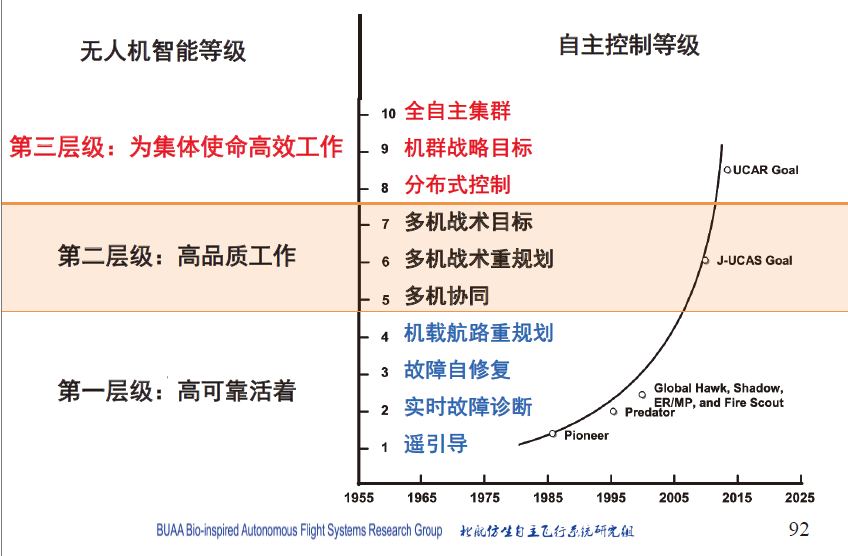
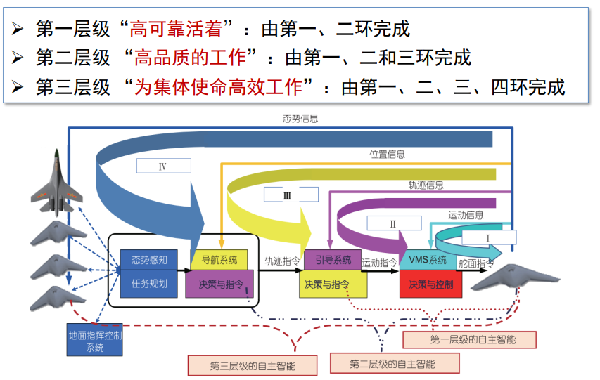
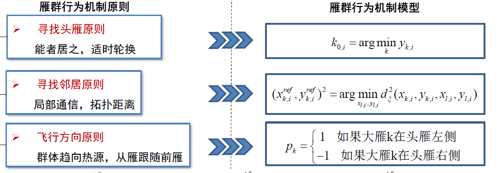

# 第一部分

## 概念大全

* **OODA循环理论**

  是由**Observation**观察、**Orientation**定位、**Decision**决策、  
  **Action**执行四个单词的首字母组合得名
* 无人机的**智能等级**与**自主控制等级**

  ​​

  ​

  * 三个信息环：自主信息环、非自主信息环、权限信息环
* 共识主动性：是一种个体间的**间接协调**机制，即**无需任何集中规划以及直接通信**完成复杂智能活动
* **集群(Swarm)** 是指由实体组成的**拥有共同目标的群组**
* **无人机集群作战**是指一组具备部分自主能力的无人机系统通过有人/无人操作装置的辅助，**在一名高级操作员监控下**，完成作战任务的过程
* 什么是无人机集群：大量自驱动系统的集体运动、具备共识自主性、通过信息的传输与合作突现智能
* 无人机集群作战的主要特征：去中心化、自主控制、集群复原、功能放大、零伤亡化
* 状态机可归纳为4个要素，即**现态、条件、动作、次态**
* 模仿学习的四个要素：**示教数据**、**模仿学习算法**（目标算法）、**策略**（学习到的算法）、**环境**。即从数据中学习已有的策略
* 将有人机/无人机共融集群对抗战术序列化分解为**攻防转换**、**目标选择**以及**行为决策**

  * 目标分配：距离上**最邻近的**、视觉上最孤立的、猎物群体最中心的
  * 行为选择：

    * 攻击行为：直接攻击、分群夹击、突袭
    * 聚集护航、分散规避

## 模型与算法

### 优化算法？

> 通过个体间不断的交互、调整、以及对环境的适应、得到问题更好的解。

* 蚁群优化算法：模拟蚂蚁群体的觅食行为
* 粒子群（飞鸟）优化算法：源自鸟群的捕食行为

  求解的两个跟新速度：认知模型、社会模型，二者求和构成每个粒子的实际更新速度

  * 认知模型反应个体粒子的更新速度（更像是更新步长）
  * 社会模型是所有粒子共享的更新速度
* 鸽群优化算法：鸽群的导航工具：太阳、磁场（指南针）、地标

### 多智能体分布式控制算法（生物群体运动模型）

> 模拟生物群体中个体间的协商、协调，化解冲突，协同产生对集群有益的决策。

#### Boid模型

#### Vicsek模型

每一时刻的个体运动速率恒定，**运动方向则是依照其所有邻居运动角度的矢量平均来进行更新**，且方向更新过程中还会受到一个均值为零的**噪声信号的干扰**

1. 模型定义

    * 个体邻居的定义：$\Gamma_i(t)=\{j| \ ||\vec x_j(t)-\vec x_i(t)||\leq R,j=1,2,...,N\}$​
    * 速度矢量：$\vec v_i(t)=[v_0\cos(\theta_i(t)),v_0 \sin(\theta_i(t))]$
    * 位置更新：$x_i(t+1)=x_i(t)+v_i(t)$
    * 速度更新（速度方向更新）：$\theta_i(t+1)=\bar \theta_i(t)_\Gamma+\xi_i(t)$
    * 邻居平均运动方向：$\bar \theta_i(t)_\Gamma=\arctan\frac{\sum_{j\in\Gamma_i(t)}\sin\theta_j(t)}{\sum_{j\in\Gamma_i(t)}\cos\theta_j(t)}$
    * 利用复数可以表示为：

      $$
      \vec x_i(t+1)=\vec x_i(t)+v_oe^{i\theta_i(t)}\\
      e^{i\theta_i(t+1)}=e^{i\xi_i(t)}\frac{\sum_{j\in\Gamma_i(t)}e^{i\theta_j(t)}}{||\sum_{j\in\Gamma_i(t)}e^{i\theta_j(t)}||}
      $$
2. 性能指标

    * 方向同步：$\lim_{t\rightarrow \infty}\theta_i(t)=\lim_{t\rightarrow \infty}\theta_j(t),\forall i,j \in \{1,2,...,N\}$
    * 序参量：**运动方向同步程度的指标**，也叫做极化程度、有序度等。定义为：$V_a(t)=\frac 1 N||\sum_{i=1}^Ne^{i\theta_i(t)}||$。当序参量为1时，说明明显达到了方向同步
    * 收敛时间：**达到方向同步的时间**。也表征其方向同步的效率。对于离散系统，一般使用以下定义：$T_c=\min_{V_a(t)\geq0.99}t$
    * 平均邻居个数：表征了**个体互交作用的规模**以及个体进行决策时需要的信息量，定义为：$\bar n(t)=\frac 1 N \sum_{i=1}^Nn_i(t),n_i(t)=|\Gamma_i(t)|$
    * 稳态统计序参量：**系统抵抗干扰的能力，** 当系统趋于稳态后（$t_S \gg0$），某段时间上的平均序参量：$\phi_S(\eta)=\frac 1 n_S\sum_{t=t_S+1}^{t_S+n_S}V_a(t)$
3. 优化方法：**基于随机视线方向的Vicsek模型（RLosVM）** 、有限视场模型（RFVM）

    RLosVM抗干扰能力更强、提高了收敛速度
4. 优化方法：基于改进拓扑规则的VM：固定邻居区域（FNR）->固定邻居个数（FNN）->每个方向只有一个邻居（MFNN）

    MFNN显著提高了收敛速度
5. 优化方法：基于分数微积分的VM（FOVM）：生物个体具有记忆能力，存在一个最优的分数阶次使得收敛性能最好

#### Couzin模型

### 生物群体智能模型

#### 鸽群的层级引领机制

* 特点：分层的领导者-跟随者模型

#### 雁群线性编队机制

* 雁群具有空气动力学优势：上洗流
* 雁群的飞行原则：寻找头雁原则、寻找邻居原则、飞行方向原则

  ​​

#### 狼群协同围捕机制

* 态势信息共享
* 不同狼群不同分工，具有完整的打击链

## 思考题

* 什么是自主系统？什么是智能系统？什么是智能自主系统？有何区别？有何联系？

  > * 可以**不受外界操控、独立完成任务的规划决策并执行**的系统是**自主系统**；
  > * 能够**根据目的和实际环境，合理决策并行动**的系统是**智能系统**；
  > * 能够根据目的和实际环境，独立完成合理的决策和行动的系统是智能自主系统；
  > * **自主在前，智能在后**，二者相辅相成；**自主未必智能**，但自主希望有智能；**智能依赖自主**，智能的等级取决于自主权的高低
  > * 智能是自主的充分条件，自主是智能的必要条件
  >
* 无人系统可以分为哪几大类？有何相同点？有何不同点？

  > 无人系统分为**无人机UAV、无人车UGV、无人艇USV、无人潜航器UUV**和包括卫星在内的**无人航天器**；
  >
  > 相同点：
  >
  > * **都是无人系统**，技术手段有很多相似相通；
  > * 都可以进行多机的协同达到更好的目标实现效果
  >
  > 不同点：根据其自身不同的特点，**各自的应用领域有所不同**，具体如下
  >
  > ||特点|
  > | ----------| --------------------------------------------------------------------------------------------------------------------------------------------------------------------|
  > |无人机|1、建造和使用成本较低； 2、地勤保障要求低，机动性强； 3、安全风险系数小； 4、应用前景旷阔； |
  > |导弹|1、通过与己方外部传感器、作战指挥平台的协同，可以丰富目标信息来源并提升装备的探测远界 2、通过与己方导弹协同，可以从不同方向不同层次攻击目标，提高对目标打击的成功概率 |
  > |无人车|1、有效提高车辆运输能力； 2、智能化水平较高； 3、提高驾驶安全性； |
  > |无人艇|1、建造和使用成本低； 2、可执行多重复杂任务； 3、动力形式多样化； |
  > |无人潜航器|1、功能完善，应用相对成熟； 2、水下作业时间长、范围广； 3、灵活性强，导航精度高； |
  >
* 以无人机为例，无人系统中的智能与自主的内涵是什么？有何区别？有何联系？
* 从OODA循环理论角度分析智能自主系统中协调、协同和协作的内涵

  是否有领导者？是否完成多种工作，还是同一个目标

  协调：具有领导者，将任务进行分解，具有信息交流

  协同：有共同的目标，进行合理的分给合作

  协作：共同完成一件事情
* **3个生物群体运动模型**，他们的异同

  > 生物群体模型的用科学家名字命名的经典模型有：
  >
  > * Boid模型主要从**定性**的角度进行说明，**比较理想化**；
  > * Vicsek模型**比较量化**，但**在个体如何影响平均的问题上解释性不强**；
  > * Couzin模型通过**改变各个分区的相对大小**，可以解释一些实际现象，但**对个体间的相互作用如何产生群体行为问题难以解释**。
  > * 它们都是从生物群体运动行为出发，对集群行为的抽象、建模。
  >
  > （详细版，By MRF同学）
  >
  > 1. Boid模型
  >
  >    * 聚集：尽量与邻居内个体靠的近一些,以避免孤立
  >    * 对齐：努力与周围的个体保持速度上的同步
  >    * 分离：避免同周围个体发生碰撞
  >
  >    是第一个提出的生物群体模型。
  >
  >    但模型中个体间的作用机制较复杂，而且不能解释其它更复杂的群体行为(如避障)。
  > 2. Vicsek模型
  >
  >    * 个体速度大小不变
  >    * 速度方向为邻域内所有个体（包含自身）速度方向的平均
  >
  >    从统计力学的角度研究了集群中个体运动方向达成一致的条件。
  >
  >    通过**局域的相互作用**而实现整体的**功能涌现**是集群运动模型给我们最为深刻的启发
  >
  >    **局限性**主要体现在它忽视了生物本身个体的差异性和局限性，同时也忽略了集群运动整体的结构性差异。
  > 3. Couzin模型
  >    注意：跟随区的大小影响着群体的表现状态
  >
  >    * Zor (zone of repulsion):避免碰撞的排斥区
  >    * Zoo (zone of orientation):从众的跟随区
  >
  >      * **跟随区很小或不存在时**，系统**呈蜂拥状态**个体聚集在一起，但是方向比较混乱，系统**极化量和角动量均很小**
  >      * **跟随区相对较小而吸引区较大**，系统**呈漩涡状态**个体聚集在一起，围绕中心运动形成环状，**系统极化量小，角动量大**
  >      * **跟随区增大而吸引区不变**，个体运动**方向一致**，形成平行群体全部个体近似向同一个方向前进，**系统极化量大，角动量**
  >    * Zoa (zone of attraction):避免群体散开的吸引区
  >
* 有人机与无人机自己最大的优势与劣势

  **智力差异**：人类智能具有强大的**推理、认知、理解、决策**能力、机器智能具有强大的**计算及记忆**能力并且有着**较高的容忍度**

  成本差异

  信息获取与处理的差异

  事态感知的差异
* 人机共融模式的五个等级

  1. **完全人控模式**：有人机对无人机进行**完全控制**
  2. **机辅人主模式**：有人机对无人机起主导作用，可主动**向无人机发起干预**
  3. **共同协商模式**：无人机和有人机之间处于一个**平等共商**的地位，双方通过**信息交互**得到各自的决策结果，并通过一个**协商网络**来产生最终结果
  4. **机主人辅模式**：无人机在遇到决策困难或是其他意外情况，会向有人机发送服务请求从而使有人机对无人机进行辅助，**无人机可决定是否采用**这一指令
  5. **完全自主模式**：无人机不依靠有人机，完全地根据自身的智能程度进行**自主对抗**

  * 模式切换的条件：**飞行员工作负荷**、集群自主信任度

    * 工作负荷主要影响因素：**信息处理难度**（任务复杂度）、**飞行员飞行经验**、**视觉信息多少**

      $$
      C_V=W_v(\log_2\frac {S_T+N_E}{N_E})
      $$
* 个体态势评估指标：**角度、方位、高度**
* 集群态势评估指标：相对优势指标（角度、方法、高度）、集群协同指标（序参量、聚集度）、优势分布指标
* 人机共融编队

  * 固定编队：平行、纵向、梯形、楔形、反楔形、圆形（护航）
  * 变拓扑：？？

‍
