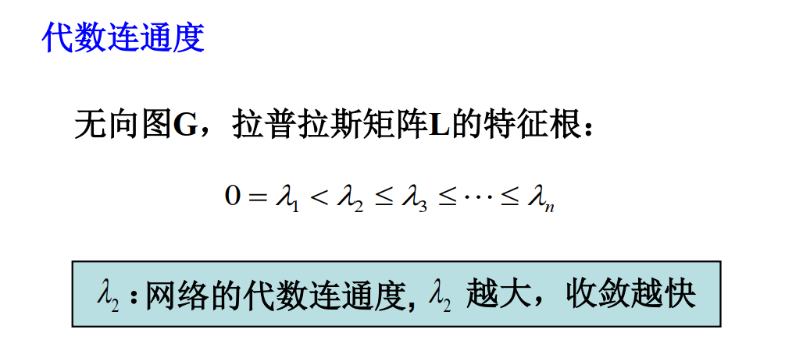
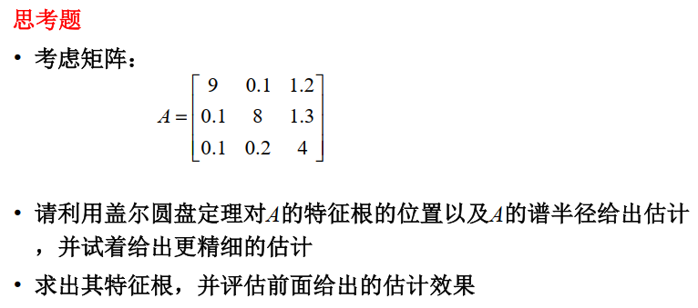

# 第二部分

# 历年考题

## 2020年

> 1. 【简答题】给了一个有向图的邻接矩阵
>    1. 考点
>       1. 画拓扑图
>       2. 结点1与结点2间有几条长度为2的路，图中有几条长度为2的路
>       3. 图的连通性是怎样的
>    2. **计算机专业入门内容**，即便非计算机专业的只要刷过点leetcode也该知道咋回事，网上资料很多，此处不详细展开，可以参考下：
>       1. [https://blog.csdn.net/qq_43133135/article/details/82390300](https://blog.csdn.net/qq_43133135/article/details/82390300)
>       2. [https://zhuanlan.zhihu.com/p/124652885](https://zhuanlan.zhihu.com/p/124652885)
> 2. 【简答题】一阶系统的一致性，问拓扑结构对一致性的影响，以及结点初始状态对最终一致状态的影响
>    1. 什么TMD叫一致
>       1. 用人话来说，就是一个且具有类似图论那样拓扑结构关系，且会互相干涉的多个节点构成的系统，各个节点在复杂交互后**最终状态无限趋近于同一个值**。
>    2. 拓扑结构对一致性的影响
>       1. 位于 **《智能自主系统的一致性理论（1）（ver2）.pdf》** P16
>       2. 无向图连通时最终可以达成一致
>       3. 有向图具有有向生成树时可以达成一致
>       4. 用人话说，甭管图有向无向，**只要存在至少一个可以直接或间接到达全部其他节点的节点，那么就可以达成一致**。
>    3. 节点初始状态对最终一致状态的影响
>       1. **位于《智能自主系统的一致性理论（1）（ver2）.pdf》P46**
>       2. 【公理】如果存在“与世隔绝”的节点，则改点最终值为初始值
>       3. 【性质】只有**能直接或间接到达任意节点的节点**的初始值才会对最终平衡态有影响
>       4. 【由此】只有强联通的时候，全体节点初始值均对最终平衡态有影响
>       5. 【定义】图的连通度分为点连通度和边连通度，定义为在图上至少删掉多少个点/边即可破坏原本的连通性质，不过这不是重点，因为无论哪种都可以通俗理解为**连通度越高，点与点内部的相互关联越紧密**。
>       6. 【性质】图的**连通度越大，系统各节点上的收敛速度越快**。

## 2021年

> 6. 给定一个拓扑结构（20分）
>
>    1. 画邻接矩阵
>    2. 写出一致性协议
>    3. 画出拉普拉斯矩阵
>    4. 分析最终是否收敛
>    5. 给你另一个拓扑结构，分析上述问题，并对其与之前的结构收敛状况进行对比
>
>    * 一致性分析计算题，看来属于**重点内容**，建议**认真看看PPT上的完整推导过程**，最起码**一致性部分PPT前半段都得好好看**

# 知识点

## 图论基础

不同于**代数问题的数量大小**和**几何问题的形状形状**

> 数学结构：定义集合中的元素以及元素之间的关系
>
> 代数结构：集合+运算关系
>
> 序结构：集合+序关系
>
> 拓扑结构：集合+拓扑结构

1. 图的定义：

    * 图定义为一个二元组$G=(V,E)$  

      $V=\{v_1,v_2,..,v_n\}$为节点集合

      $E\sub V\times V$的二元关系为边集合

      > 直积：[Note：张量积、直积、直和、Cartesian积与Kronecker积的区别与联系【物理向】 - 知乎 (zhihu.com)](https://zhuanlan.zhihu.com/p/556129070)
      >
2. 图的分类：

    * 有向图与无向图：区别在于边定义为集合（$\{v_i,v_j\}$：邻接端点）还是有序组（$(v_i.v_j)$：父结点与子节点）

    * 赋权图与无权图：是否为节点与边赋权，此时二元组扩展元多元组（加入了权值矩阵）
    * 多重图与简单图

      * 多重图：至少有一条重边

        * 重边：两个节点之间多个边
        * 环：连接到自身的边
      * 单图：无重边（可能有环）
      * **简单图**：无重边、无环
    * 有限图：$V,E$都为有限集
    * 正则图：所有节点的**度都相同**的简单**无向**图：$k$正则图各个**节点的度**为$k$  

      * 完全无向图$K_n$：拥有n个节点的，所有节点都有边相连接的，**无向简单图**  
        是$n-1$正则图
    * 完全图：

      > * 完全无向图$K_n$：拥有n个节点的，所有节点都有边相连接的，**无向简单图**
      >   是$n-1$正则图
      >

      * 完全有向图：任何两个节点。
    * 欧拉图：包含欧拉回路的图

      * 半欧拉图：包含欧拉通路的图

      是经典的一笔画问题、中国邮递员问题、怎么样才能一次走过所有的边不重复

      * 判断条件：

        * 有向图：$d_{in}(v)=d_{out}(v)\ ,\forall v\in V$
        * 无向图：$d(v)=2m,\ \forall v\in V$（偶数）
      * 有$2k$个奇点的连通图至少需要几笔才能画下来：$k$
    * 哈密顿图：包含哈密顿回路的图

      * 半哈密顿图：包含哈密顿通路的图

      * 判断条件（对于简单无向图）：

        * 若每一对顶点的度数之和大于等于$n-1$，则存在哈密顿通路
        * 若每一对顶点的度数之和大于等于$n$（$d(v)\geq\frac n 2,\forall v\in V$），则为哈密顿图
    * （无向）树：连通的（及任意两个节点都有通路）的无向图

      * 生成树：无向图$G$的生成子图并且为树
      * 任意连通无向图（其本身就是生成树）都有一个生成树
    * 有向树：除了有一个节点（根节点）以外，其余节点都只有一个父节点

      * 有向生成树：有向图$G$的**生成子图**，**并且为有向树**
      * 任意一个强连通有向图，都至少有一颗**有向生成树**

3. 图的参数

    * 阶$n$：中元素的个数（节点的数量）
    * 边数$m$：中元素的个数
    * 度d$：$与节点v关联的边即节点$v$的度

      * 出度$d_{out}$：有向图中以节点$v$作为起点的边
      * 入度$d_{in}$：有向图中以节点$v$作为终点的边
    * 路径：节点与边交替形成的序列，从$v_{i0}$到$v_{ik}$的路径

      * 路径长度：路径中边的数目
      * **通路**：**边不重复**的路径

        * 回路：闭通路
        * **欧拉**通路：经过$G$所有边的通路
        * 欧拉回路：经过$G$所有边的回路
        * **哈密顿**通路：经过$G$所有节点一次且仅一次的通路（经过所有节点的链）
        * 哈密顿回路：经过$G$所有节点一次且仅一次的回路（经过所有节点的圈）
      * **链**：**边和节点都不重复**的路径

        * 圈：闭链
      * 闭路径：起点与终点相同的路径
    * 连通性：

      * 可达性：从$u$到$v$存在一条路径
      * 无向图的连通性：任意两个节点都是可达的。
      * 有向图的（强）连通性：任意两个节点都是**互相**可达的（但是其实不一定是你指向我我指向你，也可能是通过别的节点可达）。

        * 单向连通
        * 弱连通：当有向图看作无向图时是连通的
4. 图的运算

    1. 交：边集和节点集分别相交运算后得到的新图。
    2. 并：边集和节点集分别相并运算后得到的新图。
    3. 补：只对边集进行补运算，使得图为完全图，节点集不变。
    4. 子图：顾名思义，从图中取出一部分，数学表达为：

        $$
        G'=(V'\sube V,E'\sube E\cap(V'\times V'))
        $$

        * 真子图：将$\sube$改为$\sub$
        * 生成子图：节点相同的子图（节点相同，缺少了“父图”中的某些边）：

          $$
          G =(V,E),G'=(V,E'\sube E\cap(V'\times V'))
          $$
    5. 同构：节点一一映射、边的重数相同？

        * 条件：节点数相同、边数相同、度数相同的节点个数相同
5. 图的性质

    1. 度的性质（握手定理）：一条边将会带来两个度

        $$
        \sum_{v\in V}\left.d(v)\right.=2m\\ \sum_{v\in V}\left.d_{in}(v)\right.=\sum_{v\in V}\left.d_{out}(v)\right. = m
        $$
    2. 路径长度存在定理：在$n$节点的图中，两节点的路径长度一定不大于$n-1$
6. **邻接矩阵**​$A=\left(a_{ij}\right)$  

    可以作为一种边的描述方法

    $$
    a_{ij}=\left\{ \begin{array}{l}
    1,\;\;({v_i},{v_j}) \in E\\
    0,\;\;{\rm{others}}
    \end{array} \right.
    $$

    * 注意有向图时，前为父节点，后为子节点，不是对称矩阵
    * **通过邻接矩阵求路径数**：$A^k$的元素$a_{ij}$代表**从**​$v_i$**​**到**​$v_j$** 的**长度为**​$k$** 的**路径数量**

      * $B_n=\sum_{k=1}^nA^k$：不超过$n$的路径的个数
    * 邻接矩阵的行和：出度：$d_{out}(v_i)=\sum_ja_{ij}$
    * 邻接矩阵的列和：入度：$d_{in}(v_j)=\sum_ia_{ij}$
7. **可达矩阵**​$P=(p_{ij})$  

    两个节点之间是否可达

    $$
    p_{ij}=\left\{ \begin{array}{l}
    1,\;\;v_i \text{ to }v_j\text{ is reachable}\\
    0,\;\;{\rm{others}}
    \end{array} \right.
    $$

    * 通过邻接矩阵求可达矩阵：

      $$
      P=A \vee A^{(2)}\vee A^{(3)}\vee \cdots\vee A^{(n-1)}
      $$
    * 其中$A^{(k)}:=\text{bool}(A^k)$
8. **关联矩阵**​$M=(m_{ij})_{m\times n}$  

    $m$为节点数，$n$为边数

    $$
    m_{ij}=\left\{ \begin{array}{l}
    1,\;\;e_j \text{ starts from }v_i\\
    -1,\;\;e_j \text{ end in }v_i\\
    0,\;\;{\rm{others}}
    \end{array} \right.
    $$

## 矩阵论基础

#### 基本定义

* 矩阵的谱：特征值的集合，$\sigma(A)$  

  * 谱半径：$\rho(A)=\max(|\lambda|:\lambda\in \sigma(A))$
* 重数：针对方阵$A\in\mathbb R^{n\times n}$  

  * 几何重数：特征值$\lambda$对应的**特征空间的维数**，即$\text{rank}(A-\lambda I)=n-1$
  * 代数重数：特征值$\lambda$的作为**特征多项式的零点的重数**  

    * 代数重数=1：单重
  * 半单：代数重数=几何重数
* 盖尔圆盘：方阵$A_n$的所有特征值都位于**以行绝对值之和（除对角线元素）为半径**，**以对角线元素为中心**的**圆盘并集**内：

  $$
  \cup_{i=1}^n\left\{z:|z-a_{ii}|\leq\sum_{j=1,j\neq i}^n|a_{ij}|\right\}
  $$

  * 设$D$是$A$的$k$个Ger圆构成的分支，则$D$中恰有$k$​个特征值（含重复）
  * 改进的盖尔圆盘

    $$
    \cup_{i=1}^n\left\{z:|z-a_{ii}|\leq\frac 1 {p_i}\sum_{j=1,j\neq i}^np_j|a_{ij}|\right\}
    $$

‍

## 一阶系统的一致性理论

需要注意的是以下内容中，邻接矩阵的定义的方向与图论相反：$a_{ij}$表示存在$j\rightarrow i$的边

### 无领导、固定拓扑、连续时间

#### 问题描述

对于一阶系统$\dot x_i(t)=u_i(t),\forall i\in\left\{1,2,\cdots,n\right\}$，设置一致性协议$u_i$，使得$\lim_{t\rightarrow\infty}(x_i(t)-x_j(t))=0,\forall i,j\in\left\{1,2,\cdots,n\right\}$

* 该系统的拓扑结构描述为：$G(\mathcal V,\mathcal E,\mathcal A)$，$\mathcal A=(a_{ij})$为图的（可选加权）邻接矩阵

#### 一致性协议设计

$$
u_i(t)=\sum_{j\in N_i}a_{ij}\left[x_j(t)-x_i(t)\right]
$$

* 其中$N_i$为节点$i$的邻居集，定义为：$N_i=\left\{v_j\in \mathcal V:(v_i,v_j)\in\mathcal E\right\}$
* 有个前提是，可以获得到所有agent的状态值$x_i(t)$

##### 一致性分析

* 系统能够达到一致的条件：

  * 无向图：连通时可达到一致
  * 有向图：图为强连通或**有向生成树**→图存在有向生成树

* 基于**拉普拉斯矩阵**进行分析（整体系统的状态方程）

  在一致性协议下，可得到整个系统的状态方程：

  $$
  \dot{\boldsymbol x}(t)=-L\boldsymbol x(t)
  $$

  * 其中$L$为graph Laplacian，图拉普拉斯矩阵，定义为：

    $$
    l_{ij}=\left\{ \begin{array}{l}
    \sum_{k=1,k\neq i}^na_{ij},\;\;i=j\\
    -a_{ij},\;\;{\rm{others}}
    \end{array} \right.
    $$

    * 在某种程度上，$L$代表了系统出度的大小：$L=\mathcal D_{in}-\mathcal A$​

      * 入度矩阵$\mathcal D_{in}=\text{diag}(d_{in}(v_1),\cdots,d_{in}(v_n))$（这部分与原始论文有出入）
    * 对$L$使用盖尔圆盘定理可得：$L$的每个圆盘**都过原点、** 每个圆盘的**圆心都为非负数**→$L$​所有非零特征根都具有正实部
    * $L$​**至少有一个**​$0$**​**特征根**，其对应的特征向量为$\vec 1$，即$L\vec 1=0\vec 1$。（不能证明是一致的，只是L矩阵的特性）

      由于：$L$的行和为0
    * **当**​$L$**​**只有**​$0$**​**特征根时**：系统的最终状态有$x(t)=e^{-Lt}x(0)$​

      由于$R=\lim_{t\rightarrow\infty}e^{-Lt}=\vec 1_n\xi^T$，则$x(\infty)=Rx(0)=\vec 1_n \bar x,\bar x=\xi ^T\cdot x(0)$  

      其中$\vec 1 _n^T\cdot \xi=1,\xi^TL=0$
  * （固定拓扑前提下）**当**​$L$**​**只有一个简单0特征根时**：系统能够**达到一致**

    * 各agent的初始值对终值的影响：

      * 一个节点的初始值对平衡态有影响当且仅当该节点**有一条有向路径通往**​$G$**​**中的所有其他节点**
      * 当$G$为**强连通平衡有向图**或连通无向图的时候（出度=入度），系统能够达到**平均一致**

        $$
        x(\infty)=\text{Avg}(x(0))
        $$
  * 收敛速度

    ​​

### 无领导、固定拓扑、离散时间

一致性协议是一样的，系统方程多了一个随机矩阵

一致条件：随机矩阵$F$只有一个代数重数为1 的1特征根，且其他特征根都在单位圆内，即有向生成图含有一颗有向生成树

### 无领导、切换拓扑、连续时间

* **使得**每个时段的**并集**含有一棵**有向生成树，那么系统渐近达到一致**

### 有领导、固定拓扑、连续时间

* 一致性协议（定常一致基准）：

  $$
  u_i=-\sum_{j\in N_i}a_{ij}(x_i-x_j)-a_{i(n+1)}(x_i-x_r),\ \forall i\in \{1,2,\cdots, n\}\\
  u_i=\sum_{j\in N_i}a_{ij}(x_j-x_i)+a_{i(n-1)}(x_r-x_i)
  $$

  * 其中$(n+1)$节点代表领导者，其状态表示为$x^r$·
  * 假设$G_{n+1}$是固定拓扑，算法实现**定常一致基准状态（即领导者的状态保持不变）** 的渐近一致性跟踪**当且仅当**​$G_{n+1}$**​**含有一棵有向生成树**。
* 一致性协议（时变一致基准）（**加入了基准的微分作为控制量**）：

  * 协议1

    $$
    u_i=-\sum_{j\in N_i}a_{ij}(x_i-x_j)-a_{i(n+1)}(x_i-x_r)+a_{i(n+1)}\dot x_r,\ \forall i\in \{1,2,\cdots, n\}\\
    u_i=\sum_{j\in N_i}a_{ij}(x_j-x_i)+a_{i(n-1)}(x_r-x_i)+a_{i(n+1)}\dot x_r
    $$

  * 假设$G_{n+1}$是固定拓扑，协议1实现**时变一致基准状态**的渐近一致性跟踪的条件：

    $a_{i(n+1)}=1,\forall i\in\{1,2,\cdots,n\}$即领导者跟所有跟随者都有直接的信息传递
  * 协议2

    $$
    u_i=\frac 1 {\eta_i}\sum_{j=1}^{n+1} a_{ij}\left[\dot x_j+\gamma(x_j-x_i)\right],\eta_i=d_{in}(v_i)
    $$
  * 假设$G_{n+1}$是固定拓扑，协议2实现**时变一致基准状态**的渐近一致性跟踪的条件：$G$**​**存在有向生成树**

## 二阶及高阶系统的一致性理论

应该不会考吧！pass

条件似乎就是含有一颗有向生成树，$M$矩阵仅有两个（$k$个）零特征根（$L
$仅有一个零特征根），其他根都有复实部（$L$特征根正实部）

含有一颗以领导者为根节点的有向生成树

## 集群运动控制理论

* 控制方法包括：

  * **集中式**控制：控制效果好、通行量大、鲁棒性（健壮性）差
  * **分布式**控制：简单可靠、通行量少、计算量少
  * **混合式**控制：联邦式控制：群内集中、群外分布
* 设计步骤：**定义协同条件**、**目标（代价函数）** ；定义**协作变量（优化代价函数得到最优协作变量）** ；设计**集中方案（基于协作变量（控制目标）设计集中控制器）** ；集中方案**分布式化（一致性协议共享最优协作变量）**
* 编队控制策略：领导-跟随策略、虚拟结构策略、基于行为的策略

# 思考题

1. $n$阶完全无向图$K_n
    $的边的数量

    > $$
    > C_n^2=\frac{n(n-1)}{2}
    > $$
    >
2. 摆渡人、狼、羊、干草过河，怎么摆渡才能是他们不互相伤害

    抽象为寻找通路的问题？将物种看作节点，将是否可以共存作为边，进行通路搜索
3. 七人排座位问题

    抽象为寻找哈密顿通路回路问题（人为节点、边为能否进行沟通），哈密顿通路可以保证节点不重复（因此不会存在一个人用两边/一个人坐两个位置的情况）
4. 某次会议有12人参加，其中每人至少有6个朋友，这12个人围成一圆桌，要想使每人相邻的两位都是朋友，是否可能？

    可能，每个人至少有6个朋友→每个节点至少有6个度→哈密顿回路的判断条件
5. 计算机鼓轮表面等分成24个部分，其中每一部分分别用绝缘体或导体组成。绝缘体部分给出信号为0，导体给出的信号为1，图中阴影部分为导体，空白部分表示绝缘体，根据图中鼓轮的位置，触点将得到信号为1101，如果将鼓轮顺时针方向转一个部分，触点将有信号1010。问鼓轮上的16个绝缘体和导体怎样安排，才能使鼓轮每旋转一个部分，四个触点能得到一组不同的四位二进制码，即每转一周，能得到0000到1111的16个数？

    同要抽象成寻找哈密顿图的问题，每个不同的状态都是一个节点
6. 矩阵特征值以及特征向量的几何含义：

    矩阵所表示的线性变换在**特征向量方向**上作用时，该方向**只发生大小变化**，并且大小变化**倍数为特征值**
7. 当所有代数重数=几何重数时：**矩阵可以对角化**

    * 当某个特征值的代数重数=几何重数时：Jordan块为$[1]$？
8. 使用盖尔圆盘估计矩阵特征值的位置、求特征值

    ​​
