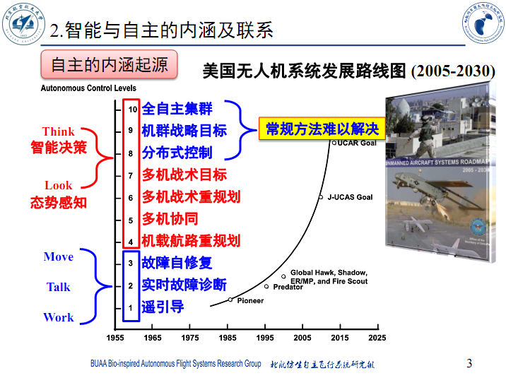

3系的跨学科课智能自主系统，基于“2020考试内容回忆版”，尝试做了一下答案，欢迎交流讨论。

# 简答题

## 段海滨部分

1. 【简答题】方向同步与序参量公式及物理意义
    1. **位于《第三章 智能自主系统-3-1》P108**
    2. 方向同步与序参量公式$$V_a  = \frac{1}{N} \left\| \sum_{i=1}^{N} {e^{i\theta_i\left(t\right)}} \right\|$$
    3. 意义的话非常简单
        1. 首先要知道一个叫做**欧拉公式**的东西$$e^{ix} = \cos{x} + i\sin{x}$$，这里可以将$$e^{ix}$$视为一个复平面上的坐标，距离原点1单位长度，且与x轴正方向弧度为$$x$$
        2. 因此**上面提到的**$$e^{i\theta_i\left(t\right)}$$**，实际上可以视为一个倾角为**$$\theta_i\left(t\right)$$**的单位向量**
        3. 将$$N$$个单位向量进行累加并求平均后，得到一个平均向量，这个**平均向量取模后即为序参量**
        4. 具体意义就是衡量在$$t$$时各个方向的一致性，考虑两种最极端的情况：
            1. 所有个体方向一致，则**序参量值为1，代表最为有序的情况**
            2. 所有个体方向极为均匀的分布在各个弧度上，则**序参量值为0，代表最为无序的情况**
            3. 介于两者之间的情况，序参量介于0到1之间，表示存在一定的有序性但是又不完全一致
1. 【简答题】无人机ad hoc网络的特点
    1. **位于《第五章 无人机集群自主通信》P13**
    2. Ad Hoc网络特点如下
        1. **自组织性**，组网不受时间、地点与基础设施的限制，靠各个节点间协调即可组网
        2. **多跳性**，各节点兼具路由器功能，可以通过多跳转发实现超远程通信
        3. **拓扑结构的动态性**，节点以任意方式和速度移动，随时可能在拓扑网络中出现或消失
        4. **网络结构的分布性**，节点在传输上的功能与地位平等，系统鲁棒性和抗毁性好
        5. **信道资源的有限性**，无线信道理论带宽低，且复杂电磁环境下实际带宽进一步降低
        6. **链路的单向性**，因为发射功率不对称以及网络拓扑结构等因素，可能存在仅单向通信的情况
        7. **节点能源的有限性**，节点多为便携式设备，电池容量低、内存小、CPU性能低
        8. **较差的安全性**，分布式无线移动网络容易被中间人、DOS或被动窃听等方式攻击
    3. 无人机群Ad Hoc网络特点
        1. **数据量大**，传感器采集的信息多为图像、视频信息，占存储很高，传感器一多起来尤其如此
        2. **数据结构复杂**，传感器、数据格式均多种多样
        3. **持续时间长**，无人机数据采集量大，需要分包传输，故需要持续传输
        4. **数据传输实时性要求高**，无人机对网络延迟要求很高，但是宽带又十分有限
        5. **链路不稳定**，飞机本身就在高速运动，通讯拓扑结构不稳定，丢包率容易飞涨

## 魏老师部分

1. 【简答题】给了一个有向图的邻接矩阵
    1. 考点
        1. 画拓扑图
        2. 结点1与结点2间有几条长度为2的路，图中有几条长度为2的路
        3. 图的连通性是怎样的
    2. **计算机专业入门内容**，即便非计算机专业的只要刷过点leetcode也该知道咋回事，网上资料很多，此处不详细展开，可以参考下：
        1. [https://blog.csdn.net/qq_43133135/article/details/82390300](https://blog.csdn.net/qq_43133135/article/details/82390300)
        2. [https://zhuanlan.zhihu.com/p/124652885](https://zhuanlan.zhihu.com/p/124652885)
2. 【简答题】一阶系统的一致性，问拓扑结构对一致性的影响，以及结点初始状态对最终一致状态的影响
    1. 什么TMD叫一致
        1. 用人话来说，就是一个且具有类似图论那样拓扑结构关系，且会互相干涉的多个节点构成的系统，各个节点在复杂交互后**最终状态无限趋近于同一个值**。
    2. 拓扑结构对一致性的影响
        1. 位于**《智能自主系统的一致性理论（1）（ver2）.pdf》**P16
        2. 无向图连通时最终可以达成一致
        3. 有向图具有有向生成树时可以达成一致
        4. 用人话说，甭管图有向无向，**只要存在至少一个可以直接或间接到达全部其他节点的节点，那么就可以达成一致**。
    3. 节点初始状态对最终一致状态的影响
        1. **位于《智能自主系统的一致性理论（1）（ver2）.pdf》P46**
        2. 【公理】如果存在“与世隔绝”的节点，则改点最终值为初始值
        3. 【性质】只有**能直接或间接到达任意节点的节点**的初始值才会对最终平衡态有影响
        4. 【由此】只有强联通的时候，全体节点初始值均对最终平衡态有影响
        5. 【定义】图的连通度分为点连通度和边连通度，定义为在图上至少删掉多少个点/边即可破坏原本的连通性质，不过这不是重点，因为无论哪种都可以通俗理解为**连通度越高，点与点内部的相互关联越紧密**。
        6. 【性质】图的**连通度越大，系统各节点上的收敛速度越快**。

## 邓亦敏部分

1. 【简答题】无人机与无人车异构侦察任务中，感知、任务规划、路径规划的作用
    1. 感知
        1. **智能感知解决的是Look的问题**，包括通过各种传感器获取外部/自身信息的能力（**“感”**），也包括通过记忆、学习、判断、推理等过程，达到认知环境和对象类别与属性（**“知”**）的能力。
        2. 无人机装备雷达和红外，可以采集战场环境数据（**“感”**），并基于数据提供全区域动态监视（**“知”**）
        3. 无人车通过光学、雷达、激光等传感器对数据进行采集（**“感”**），并由此判定其他车辆的位置信息（**“知”**）
        4. （然后想想空地一体的侦查任务中这两者应该是怎么分工的，说一说就行）
    2. 任务规划
        1. 规划是智能决策的一部分（**智能决策是与智能感知同级的概念，解决的是Think的问题**），具体是指**在行动之前拟定行动步骤**
        2. （这里不展开细节，就讲讲思路）任务规划整体上基于对任务的预定义模型，将任务尝试拆分为子任务，并且对各个子任务均有评估机制（例如评估成功率、可执行性等），并可以汇聚成上层人物的评估结果以及执行方案（整体思路为**“化整为零”，再“由零汇整”**）。因此结合这一场景说一说应该就ok
    3. 路径规划
        1. 整体与任务规划类似，为下层执行方案层面的规划
2. 【简答题】简述路径规划算法中深度优先搜索、广度优先搜索、A*算法的内涵与联系（还是区别，忘了）
    1. 位于《智能自主系统-2021-Sec5.pdf》全部
    2. 深度优先搜索（DFS）算法**优先扩展搜索深度大的节点**，可以快速的得到一条**可行路径**，但是得到的**第一条路径往往不是最短**的
    3. 广度优先搜索（BFS）算法**优先扩展深度小的节点**，呈波状的搜索方式，**搜索到的第一条路径是最短路径**
    4. 最短路径Dijkstra算法，**解决单源最短路径问题**，用人话说就是从一个指定的点出发，求出从改点到达其他任一点的最短路径。
    5. **A*算法本质上依赖一个评估函数**，用人话说就是到了地图上的一个点你得能大致估一下离终点还有多远，例如通过欧拉距离或哈密尔顿距离估一个路程，虽然有可能因此钻进死胡同不过只要顺着这个评估函数的引导，以及目前记录下的从老家已经出门的路程，你总能找到地方的，而且还不会太差，**如果评估函数合适的话也可以确保一次找到最短路径**。
    6. 概率路线图法（PRM） 在高维空间环境有较高的算法效率，复杂度只依赖于路径本身寻找难度，最适合真实的工程应用。

# 分析题

1. 【分析题】给出一大段鹰的觅食与捕食材料，要求将鹰的行为与无人机行为映射，并给出映射规则。老师说要写公式，还要图文并茂。
   
    1. **位于《第四章 智能自主系统-4-1》全部**
    2. 鸽群P76
    3. 雁群P102
    4. 狼群P112
    5. （有待进一步完善）
2. 【分析题】无人机系统等级图，要求说出智能自主系统关键技术在第5级（机群协同）与第10级（全自主集群）的区别与联系。

    1. **位于《第二章 智能自主系统内涵-2》P3**

        

    2. 就这么个玩意

        1. 1-3解决的是**单个智能体的基础生存与工作问题**（例如无人机如何自动控制各舵机以实现正常飞行，如何控制各个传感器以实现正常收集数据）
        2. 4-7让**多个智能体协同完成一项给定的具体目标**（例如让无人机群之间成编队飞行，以机群为单位应对敌电战机干扰或个体战损等情况，完成一次给定了详细执行方案的巡航任务）
        3. 8-10则是要**让智能体集群解决一项给定的抽象问题**（例如让由无人机、无人战车、无人船只共同自动进行大范围海防，甚至自动打赢一场战役乃至战争，**这类问题常规方法难以解决**）

    3. 因此，5实际上需要解决多智能体的协作问题，基于各个智能体的感知与规划能力实现协作，**重点是少量智能体之间的协同工作**；而10则是以智能体集群为单位，基于集群整体的感知与规划能力实现全自主工作，**重点是智能集群的战略级感知、规划与评估**。

# 思考题（可能考）

## 什么是自主系统？什么是智能系统？什么是智能自主系统？有何区别？有何联系？

（By BZ2103某同学和MRF同学）

* 可以**不受外界操控、独立完成任务的规划决策并执行**的系统是**自主系统**；

* 能够**根据目的和实际环境，合理决策并行动**的系统是**智能系统**；

* 能够根据目的和实际环境，独立完成合理的决策和行动的系统是智能自主系统；

* **自主在前，智能在后**，二者相辅相成；**自主未必智能**，但自主希望有智能；**智能依赖自主**，智能的等级取决于自主权的高低

## 无人系统可分为哪几大类？有何相同点？有何不同点？ 

（By BZ2103某同学和MRF同学）

无人系统分为**无人机、无人车、无人艇、无人潜航器**和包括卫星在内的**无人航天器**；

相同点：

* **都是无人系统**，技术手段有很多相似相通；

* 都可以进行多机的协同达到更好的目标实现效果

不同点：根据其自身不同的特点，**各自的应用领域有所不同**，具体如下

|            | 特点                                                         |
| ---------- | ------------------------------------------------------------ |
| 无人机     | 1、建造和使用成本较低； 2、地勤保障要求低，机动性强； 3、安全风险系数小； 4、应用前景旷阔； |
| 导弹       | 1、通过与己方外部传感器、作战指挥平台的协同，可以丰富目标信息来源并提升装备的探测远界 2、通过与己方导弹协同，可以从不同方向不同层次攻击目标，提高对目标打击的成功概率 |
| 无人车     | 1、有效提高车辆运输能力； 2、智能化水平较高； 3、提高驾驶安全性； |
| 无人艇     | 1、建造和使用成本低； 2、可执行多重复杂任务； 3、动力形式多样化； |
| 无人潜航器 | 1、功能完善，应用相对成熟； 2、水下作业时间长、范围广； 3、灵活性强，导航精度高； |

## 生物群体模型的用科学家名字命名的经典模型有哪些（至少3个）？这些模型有何异同？ 

(By BZ2013某同学)

生物群体模型的用科学家名字命名的经典模型有：

* Boid模型主要从**定性**的角度进行说明，**比较理想化**；
* Vicsek模型**比较量化**，但**在个体如何影响平均的问题上解释性不强**；
* Couzin模型通过**改变各个分区的相对大小**，可以解释一些实际现象，但**对个体间的相互作用如何产生群体行为问题难以解释**。
* 它们都是从生物群体运动行为出发，对集群行为的抽象、建模。

（详细版，By MRF同学）

1. Boid模型

* 聚集：尽量与邻居内个体靠的近一些,以避免孤立
* 对齐：努力与周围的个体保持速度上的同步
* 分离：避免同周围个体发生碰撞

Boid模型所体现的类似生物运动的特性是该模型最重要的特点。  Boid 模型的意义及存在的问题；Boid 模型是在研究鱼群的运动中提出的，它直接来源于对自然界生物的观察与实际结合的非常紧密。可以解释生物群体的群聚、同步以及形成圆环的现象，并揭示了这些现象背后的本质联系具有重大的意义。但模型中个体间的作用机制较复杂，而且不能解释其它更复杂的群体行为(如避障)。

2. Vicsek模型，

* 个体速度大小不变
* 速度方向为邻域内所有个体（包含自身）速度方向的平均

从统计力学的角度研究了集群中个体运动方向达成一致的条件，提出了来模拟和解释非平衡系统中的聚类、输运和相变的模型Vicsek模型。每个参与群集运动的个体可看作独立的自驱动的个体，每个个体以恒定的速率在二维平面内运动，下一时刻个体速度的方向设定为自己及周围其他个体的平均速度方向。这样经过有限次的调整后所有的个体会最终达到共同的速度，即所有个体的飞行方向趋于一致。在Vicsek模型中，个体只能了解到自己周围视野半径内邻居的信息，而这个信息是一个局域的信息。在通过有限次调整之后，系统可达到整体的同步。这种通过局域的相互作用而实现整体的功能涌现是集群运动模型给我们最为深刻的启发，Vicsek模型存在的局限性主要体现在它忽视了生物本身个体的差异性和局限性，同时也忽略了集群运动整体的结构性差异。

3. Couzin模型

* Zor (zone of repulsion):避免碰撞的排斥区
* Zoo (zone of repulsion):从众的跟随区
    * 跟随区很小或不存在时，系统呈蜂拥状态个体聚集在一起，但是方向比较混乱，系统极化量和角动量均很小
    * 跟随区相对较小而吸引区较大，系统呈漩涡状态个体聚集在一起，围绕中心运动形成环状，系统极化量小，角动量大
    * 跟随区增大而吸引区不变，个体运动方向一致，形成平行群体全部个体近似向同一个方向前进，系统极化量大，角动量

* Zoa (zone of attraction):避免群体散开的吸引区

 

##  什么是方向同步？什么是序参量？什么是收敛时间？什么是稳态统计序参量？

(By BZ2013某同学)

* 方向同步：对于集群中的任意两个个体，
    * 如果存在某一大于零的时刻$t_0$，当$t \geq t_0$时，使得两个个体的运动方向相同，则称群体系统在$t_0$时刻达到了方向同步；
    * 如果是在$t \to \infin$的情况下，两个个体的运动方向的极限相同，则称群体系统渐近达到方向同步。

* 序参量：序参量是表征群体系统中所有个体运动方向同步程度的指标，它是所有个体的$e^{i\theta}$的均值。

* 收敛时间：使群体系统在$t_0$时刻达到方向同步的$t_0$称为收敛时间。

* 稳态统计序参量：当系统演化较长时间后，统计某段时间上序参量的均值，记为群体系统的稳态统计序参量。

（By [HansBug](https://github.com/HansBug)）

* 序参量公式：$$V_a  = \frac{1}{N} \left\| \sum_{i=1}^{N} {e^{i\theta_i\left(t\right)}} \right\|$$
    * 所有个体的方向同步程度
    * 可以理解为**所有个体方向弧度在复平面上的单位向量均值的模**

* 收敛时间公式：$T_c = \min_{V_a \geq 0.99}{T}$
    * 系统达到方向同步状态的快慢程度
    * 可以理解为**序参量值（即全体方向同步程度）达到某一高度的最小时间**
* 稳态统计序参量：$\phi_s\left(\eta\right) = \frac{1}{n_s}\sum_{t=t_s+1}^{t_s+n_s}{V_a\left(t\right)}$
    * 系统抵抗干扰的能力
    * 可以理解为达到稳定状态后，**时间区间$\left[t_s+1, t_s+n_s\right]$之间序参量值的平均数**

## 根据大雁编队机制和狼群任务分配机制，您认为蚂蚁的行 为机制给无人机集群有何启发？

(By BZ2013某同学)

通过个体间不断的交互、调整，以及对环境的适应，得到问题更好的解。

* **简单合作觅食**：觅食路线固定，单个工蚁独自完成觅食，释放化学激素而与近距离同伴保持联系

* **小组觅食**：发现食物时，释放分泌物作标记，回巢并一路释放该分泌物作为示踪标记，在巢内做“摇摆表演”来召集同伴

* **集体觅食**：是当某一头工蚁发现食物后回巢告知同伴，大批的工蚁将一起涌向食物当蚁群的运动路径上出现障碍物时，可很快地重新找到最优路径基于信息素，蚂蚁会以越来越大的概率选择最短路径。模拟蚂蚁群体的觅食行为提出了蚁群优化

更加**扁平化的信息分享机制，给每个个体较高的信息权限，使其能集群自主的实现任务**。

## 如何用最小二乘法实现一般情况下的时间配准？（非相同起始时刻、非相同采样周期）

(By BZ2013某同学)

可以用内插外推法对数据进行插值，得到起始时间相同且周期比为整数的数据，再进行最小二乘的处理。

## 是否存在奇数阶奇数度正则图？

(By BZ2013某同学)

不存在，因为奇数阶奇数度正则图度总数为奇数，这是不可能的。

（By [HansBug](https://github.com/HansBug)）

* 正则图定义为**全部节点度数相同的图**。

* **无论是有向图还是无向图，都满足总度数为偶数**。（你想，一条边不得有始有终吗，每一头都是一个度，总度数肯定偶数啊）

## Ｋn有多少条边？

(By BZ2013某同学)

$\frac{n\left(n-1\right)}{2}$条

（By [HansBug](https://github.com/HansBug)）

K_n意思是n阶完全图

## 七个人：A-G，已知：A讲英语；B讲英语和汉语；C讲英语、意大利语和俄语；D讲日语和汉语；E讲德国和意大利语；F讲法语、日语和俄语；G讲法语和德语；试问应如何排座，才能使每个人都能和他身边的人交谈？

(By BZ2013某同学)

ABDFGECA。

（By [HansBug](https://github.com/HansBug)）

这是一个哈密尔顿回路问题，人是点，语言可交流则在两点间连边，构成一个图，然后求图上的哈密尔顿回路就完事了。

## 某次会议有12人参加，其中每人至少有6个朋友，这12个人围成一圆桌，要想使每人相邻的两位都是朋友，是否可能？

(By BZ2013某同学)

 可能。12个人按照朋友关系组成的图中，每个结点的度均大于等于6，所以这个图中存在一条哈密顿回路，按照哈密顿回路的顺序将这12人排成一桌，可以保证相邻的两个人是朋友。