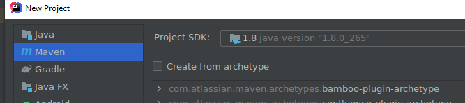
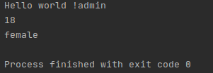

## 编写程序
### 使用idea创建maven工程


### 在pom.xml中添加以下依赖
```xml
<properties>
    <dubbo.version>2.7.8</dubbo.version>
</properties>
    
<dependencies>
    <dependency>
        <groupId>org.apache.dubbo</groupId>
        <artifactId>dubbo</artifactId>
        <version>${dubbo.version}</version>
    </dependency>
    <dependency>
        <groupId>org.apache.dubbo</groupId>
        <artifactId>dubbo-dependencies-zookeeper</artifactId>
        <version>${dubbo.version}</version>
        <type>pom</type>
    </dependency>
</dependencies>
```
### 创建package：api，并实现PersonService接口
```java
package api;

public interface PersonService {
    String sayHello() ;
    public int getAge() ;
    public void setAge(int age);
    public boolean getGender() ;
    public void setGender(boolean gender);
    public String getName();
    public void setName(String name);
}

```
### 创建package：provider，完成PersonService的具体实现
```java
package provider;

import api.PersonService;

public class PersonServiceImpl implements PersonService {
    private String name;
    private int age;
    private boolean gender;


    public String sayHello() {
        return "Hello world !" + name;
    }


    public int getAge() {
        return age;
    }

    public void setAge(int age) {
        this.age = age;
    }

    public boolean getGender() {
        return gender;
    }

    public void setGender(boolean gender) {
        this.gender = gender;
    }

    public String getName() {
        return name;
    }

    public void setName(String name) {
        this.name = name;
    }
}

```
### 创建provider的应用作为rpc的服务端
```java
package provider;


import api.PersonService;
import org.apache.dubbo.config.ApplicationConfig;
import org.apache.dubbo.config.RegistryConfig;
import org.apache.dubbo.config.ServiceConfig;

import java.util.concurrent.CountDownLatch;

public class Application {
    private static String zookeeperHost = System.getProperty("zookeeper.address", "127.0.0.1");

    public static void main(String[] args) throws Exception {
        ServiceConfig<PersonService> service = new ServiceConfig<>();
        service.setApplication(new ApplicationConfig("first-dubbo-provider"));
        service.setRegistry(new RegistryConfig("zookeeper://" + zookeeperHost + ":2181"));
        service.setInterface(PersonService.class);
        service.setRef(new PersonServiceImpl());
        service.export();

        System.out.println("dubbo service started");
        new CountDownLatch(1).await();
    }
}
```
### 创建package：consumer，编写应用调用RPC服务
```java
package consumer;


import api.PersonService;
import org.apache.dubbo.config.ApplicationConfig;
import org.apache.dubbo.config.ReferenceConfig;
import org.apache.dubbo.config.RegistryConfig;

public class Application {
    private static String zookeeperHost = System.getProperty("zookeeper.address", "127.0.0.1");

    public static void main(String[] args) {
        ReferenceConfig<PersonService> reference = new ReferenceConfig<>();
        reference.setApplication(new ApplicationConfig("first-dubbo-consumer"));
        reference.setRegistry(new RegistryConfig("zookeeper://" + zookeeperHost + ":2181"));
        reference.setInterface(PersonService.class);
        PersonService service = reference.get();
        
        service.setName("admin");
        service.setAge(18);
        service.setGender(false);
        System.out.println(service.sayHello());
        System.out.println(service.getAge());
        System.out.println(service.getGender()?"male":"female");
    }
}

```

## 运行
### 编写docker-compose.yml
```yml
version: '2'
services:
    zookeeper:
        image: wurstmeister/zookeeper:3.4.6
        ports:
          - 2181:2181
```
### 启动zookeeper

    docker-compose up -d


### 启动provider和consumer应用

## 运行结果

