## 环境配置
### 下载 [axis2-1.7.9-bin.zip和eclipse插件(2个)](http://axis.apache.org/axis2/java/core/download.html)
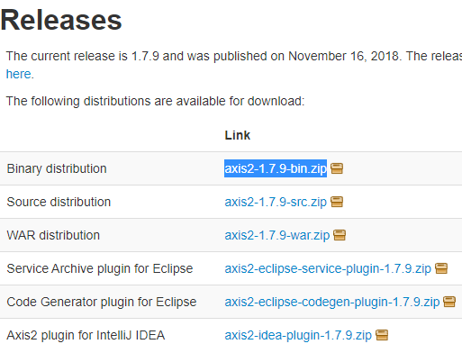

*坑1：idea的插件无法安装在idea最新版本下，需要用eclipse的插件。* 

### 下载并安装 [eclipse ee](https://www.eclipse.org/downloads/packages/release/2018-09/r)
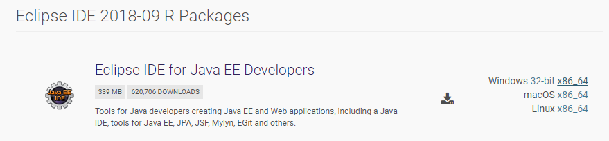

*坑2：eclipse最新版本也不支持eclipse的插件，需要使用2018-09之前的版本。*

### 配置环境变量
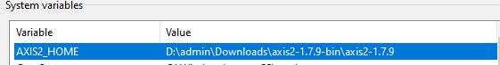

### 安装eclipse插件
将org.apache.axis2.eclipse.codegen.plugin_1.7.9.jar和org.apache.axis2.eclipse.service.plugin_1.7.9.jar放到eclipse的dropins目录下。

*坑3：插件如果放在plugins目录下需要修改bundles.info文件。*

## 创建项目

### 创建 Dynamic Web Project
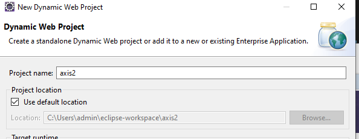

### 设置 axis2 runtime路径


## 实现
### 创建person类

```java
public class person  {
    private static String name;
    private static int age;
    private static boolean gender;

    public person(){}

    public String sayHello() {
        return "Hello world !" + name;
    }

    // getters and setters
}
``` 

*坑4： 每次调用服务时会new一个新的person，严格来说person应该用单例模式，这里简单的把成员变量设为了static。*

### 将代码导出成jar包
### File -> New -> Other -> Axis2 Wizards -> Axis2 Service Archiver
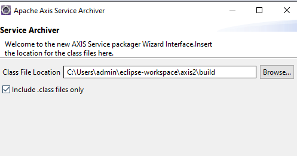

*坑5：不要只在此处选择person.class目录,后面load会类成员函数会失败!*

### SKIP WSDL, 下一步，添加之前生成的jar包
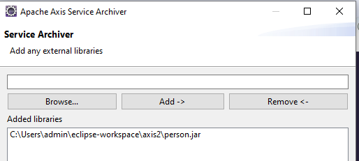

### 自动生成service XML，下一步，输入服务名称，类名，选择类方法
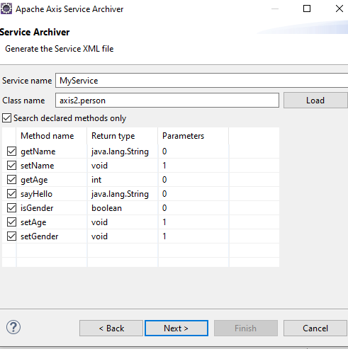

### 将生成的arr保存到%AXIS2_HOME%\repository\services下，使用%AXIS2_HOME%\bin\axis2server.bat启动服务。
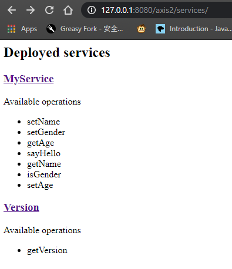

## 生成的WSDL
```xml
<?xml version="1.0" encoding="UTF-8"?>
<wsdl:definitions xmlns:wsdl="http://schemas.xmlsoap.org/wsdl/" xmlns:ns="http://axis2" xmlns:xs="http://www.w3.org/2001/XMLSchema" xmlns:ns1="http://org.apache.axis2/xsd" xmlns:soap="http://schemas.xmlsoap.org/wsdl/soap/" xmlns:soap12="http://schemas.xmlsoap.org/wsdl/soap12/" xmlns:http="http://schemas.xmlsoap.org/wsdl/http/" xmlns:mime="http://schemas.xmlsoap.org/wsdl/mime/" xmlns:wsaw="http://www.w3.org/2006/05/addressing/wsdl" targetNamespace="http://axis2">
    <wsdl:documentation>MyService</wsdl:documentation>
    <wsdl:types>
        <xs:schema attributeFormDefault="qualified" elementFormDefault="qualified" targetNamespace="http://axis2">
            <xs:element name="setName">
                <xs:complexType>
                    <xs:sequence>
                        <xs:element minOccurs="0" name="name" nillable="true" type="xs:string"/>
                    </xs:sequence>
                </xs:complexType>
            </xs:element>
            <xs:element name="setGender">
                <xs:complexType>
                    <xs:sequence>
                        <xs:element name="gender" type="xs:boolean"/>
                    </xs:sequence>
                </xs:complexType>
            </xs:element>
            
    ......
```
## 客户端
### File -> New -> Other -> Axis2 Wizards -> Axis2 Code Generator

从wsdl生成java代码，并选择之前生成的wsdl，下一步。

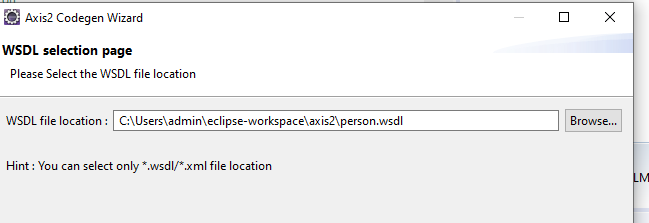

### 选择代码输出路径，添加axis2的jar包。

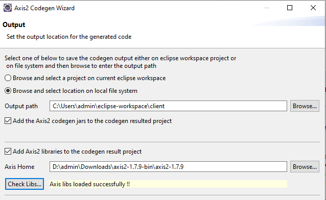

*坑6：不要选择选项1把代码输出到当前的workspace下。*

### 编写main函数
```java
public class Test {
 public static void main(String args[]) throws RemoteException {
	 MyService myService=new MyServiceStub();
	 SetName setName=new SetName();
	 setName.setName("admin");
	 myService.setName(setName);
	 SayHelloResponse sayHelloResponse=myService.sayHello(new SayHello());
	 System.out.println(sayHelloResponse.get_return());  
 }
}
```
### 运行结果

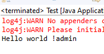
