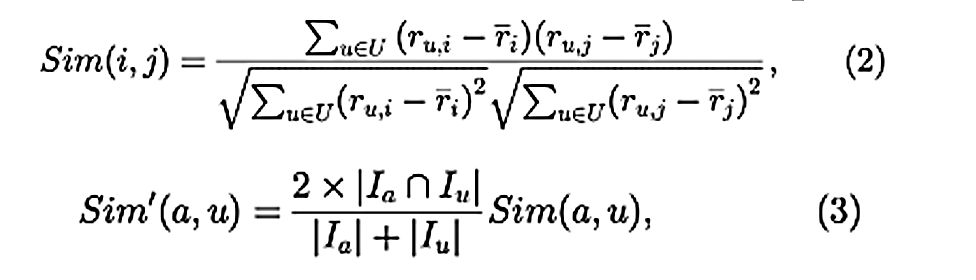
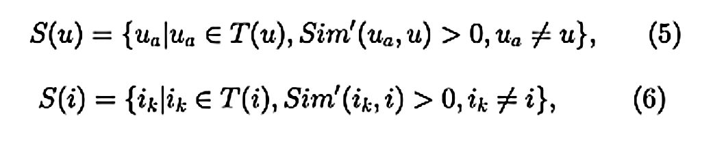
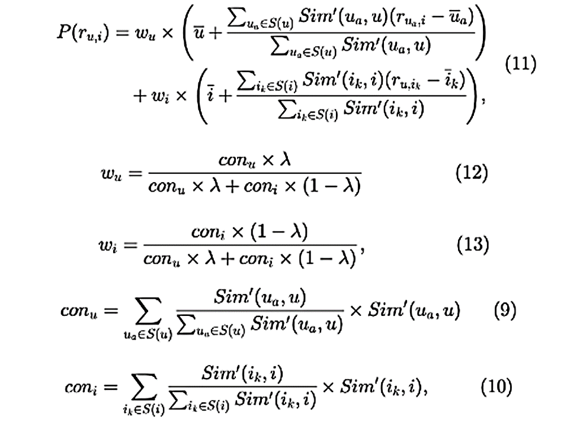
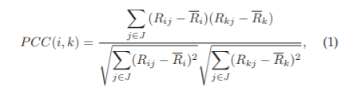
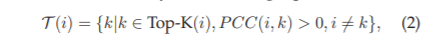

# 服务计算 作业二
## 配置环境
#### 安装python2.7和**python2.7-dev**
    apt install python2.7 python2.7-dev
    
#### clone 源码
    git clone https://github.com/icsme2020/WS-DREAM.git
    
#### 创建并运行虚拟环境
    cd WS-DREAM
    python3 -m virtualenv -p python2.7 venv
    source venv/bin/activate
    
#### 安装依赖
    pip install numpy==1.8.1 scipy==0.13.3 Cython -i https://pypi.tuna.tsinghua.edu.cn/simple
    
#### 安装
    python setup.py install
    


## UIPCC

### 运行

#### 下载数据集2
    cd data/dataset#2
    python download_dataset#2.py

#### 进入目录
    cd ../../benchmarks/time-aware/UIPCC
    
#### 修改round为1，缩短运行时间
```python
    'metrics': ['MAE', 'NMAE', 'RMSE', 'MRE', 'NPRE'], # delete where appropriate           
    'density': np.arange(0.05, 0.31, 0.05), # matrix density
    'rounds': 1, # how many runs are performed at each matrix density
    'topK': 10, # the parameter of TopK similar users or services
    'lambda': 0.4, # the combination coefficient of UPCC and IPCC
   
```
####  运行
    python run_tp.py
#### 结果
```
Average result: [result/UPCC_dataset#2_tp_result]
Metrics: ['MAE', 'NMAE', 'RMSE', 'MRE', 'NPRE']
density=0.05:  [ 10.3860  0.9120  43.2909  1.8621  17.8920]
density=0.10:  [ 9.5014  0.8350  40.7598  1.6453  17.2577]
density=0.15:  [ 8.9477  0.7877  38.8087  1.5318  17.1073]
density=0.20:  [ 8.4906  0.7484  37.1719  1.4230  16.9622]
density=0.25:  [ 8.1474  0.7182  35.6727  1.3429  16.8649]
density=0.30:  [ 7.8938  0.6961  34.6294  1.2712  16.8773]
Average result: [result/IPCC_dataset#2_tp_result]
Metrics: ['MAE', 'NMAE', 'RMSE', 'MRE', 'NPRE']
density=0.05:  [ 10.0405  0.8818  45.3462  0.7738  10.8654]
density=0.10:  [ 9.6518  0.8478  43.1114  0.7842  11.4137]
density=0.15:  [ 9.5135  0.8364  42.4567  0.7708  11.3958]
density=0.20:  [ 8.9333  0.7866  41.0629  0.7112  10.4225]
density=0.25:  [ 8.3484  0.7357  39.2411  0.6573  9.4074]
density=0.30:  [ 7.9666  0.7025  37.8419  0.6254  8.8005]
Average result: [result/UIPCC_dataset#2_tp_result]
Metrics: ['MAE', 'NMAE', 'RMSE', 'MRE', 'NPRE']
density=0.05:  [ 9.8958  0.8690  43.9638  1.4929  14.9539]
density=0.10:  [ 9.3041  0.8174  41.5855  1.4295  15.0142]
density=0.15:  [ 8.9638  0.7884  40.1955  1.3789  14.9498]
density=0.20:  [ 8.3983  0.7397  38.5635  1.2649  14.3013]
density=0.25:  [ 7.8756  0.6941  36.7211  1.1659  13.6215]
density=0.30:  [ 7.5158  0.6627  35.2921  1.1022  13.2643]
```
### 原理
在论文QoS-Aware Web Service Recommendation by Collaborative Filtering中对相似性进行加权，并在预测时对用户和服务进行加权。首先是相似度计算，先计算PCC，然后对PCC的结果进行加权:



然后使用加权后的相似度，寻找最相似的用户或者服务:



然后依靠邻居来计算:


## NTF

### 运行

#### 进入目录
    cd benchmarks/time-aware/NTF
    
#### 修改round为1，缩短运行时间
```python
'metrics': ['MAE', 'NMAE', 'RMSE', 'MRE', 'NPRE'], # delete where appropriate           
'density': np.arange(0.05, 0.31, 0.05), # matrix density
'rounds': 1, # how many runs are performed at each matrix density
'dimension': 10, # dimenisionality of the latent factors
```
####  运行
    python run_tp.py
#### 结果
```
Average result: [result/dataset#2_tp_result]
Metrics: ['MAE', 'NMAE', 'RMSE', 'MRE', 'NPRE']
density=0.05:  [ 4.1800  0.3681  23.8395  0.3210  2.3377]
density=0.10:  [ 4.1247  0.3633  23.1185  0.3208  2.4306]
density=0.15:  [ 4.0055  0.3534  22.1972  0.3167  2.4450]
density=0.20:  [ 4.0033  0.3536  21.9754  0.3170  2.4239]
density=0.25:  [ 4.0284  0.3556  21.7842  0.3211  2.4335]
density=0.30:  [ 4.0091  0.3539  21.8340  0.3159  2.4196]
```
### 原理
在论文Temporal QoS-Aware Web Service Recommendation via Non-negative Tensor Factorization中，通过非负张量分解的时间QoS感知Web服务建议。论文通过考虑第三动态上下文信息，提出了一个时间QoS感知Web服务推荐框架，以预测各种时间上下文下丢失的QoS值。此外，将此问题形式化为广义张量因子分解模型，并提出了一种能够处理用户服务时间模型的三元关系的非负张量因子分解（NTF）算法。

对于Web服务用户，服务QoS属性不如服务提供者声明的那么准确。为了获得每个服务用户的准确Web服务QoS值，论文采用了基于时间QoS的Web服务推荐框架来预测QoS值。如图所示，QoS预测框架收集来自不同服务用户的Web服务QoS信息。

如果Web服务用户的服务QoS信息贡献超过阈值，则可以通过我们的预测框架获得服务QoS值预测。
 
服务QoS信息贡献越大，可以实现更高的QoS值预测精度。在收集了大量的QoS信息后，我们对训练数据过滤了一些劣质的QoS信息，并使用预测引擎生成了用于预测丢失的QoS值。

遵循以下步骤：给定具有用户服务交互作用的时间信息的Web服务QoS数据集，请在给定的时间上下文下向每个用户推荐最佳服务列表。

本文采用CP分解模型重建时域三维用户服务时间张量。我们的方法设计为两个阶段的过程。首先，构造由观测到的QoS值组成的时间QoS值张量。然后，我们提出了一种非负张量分解方法来预测张量中丢失的QoS值。

当服务用户调用Web服务时，我们的推荐系统将收集QoS属性的性能。运行一段时间后，推荐器会累积Web服务QoS属性数据的集合，这些数据可以由一组四组用户ID，ServicID，TimeID，Rating（或简称为u，s，t，r）表示。

使用QoS值数据，可以构建时间三维张量Y∈RI×J×K，其中I，J，K分别是用户数，服务数和时间段。

张量的每个条目表示在时间段k的u，s对的QoS值。

算法2中给出了三维时间张量构造算法：输入是一组Web服务QoS值，输出是构造的时间张量Y∈RI×J×K。张量Y中的每个额叶切片对应于每个时间间隔的u对s QoS值矩阵。


## LN_LFM

### 运行

#### 进入目录
    cd benchmarks/model-based/LN_LFM
    
#### 修改round为4，缩短运行时间
```python
        'metrics': ['MAE', 'NMAE', 'RMSE', 'MRE', 'NPRE'], # delete where appropriate
        'density': np.arange(0.05, 0.31, 0.05), # matrix density
        'rounds': 4, # how many runs are performed at each matrix density
        'dimension': 10, # dimenisionality of the latent factors
```
####  运行
    python run_tp.py
#### 结果
```
Average result: [result/dataset#1_tp_result]
('Metrics:', ['MAE', 'NMAE', 'RMSE', 'MRE', 'NPRE'])
('density=0.05: ', array([ 20.3785,  0.4290,  52.2246,  0.4878,  4.6288]))
('density=0.10: ', array([ 17.7190,  0.3728,  46.9562,  0.4164,  4.0143]))
('density=0.15: ', array([ 16.6929,  0.3511,  45.1001,  0.3830,  3.7543]))
('density=0.20: ', array([ 16.4253,  0.3454,  44.0930,  0.3889,  3.7714]))
('density=0.25: ', array([ 16.0351,  0.3372,  43.7371,  0.3639,  3.6269]))
('density=0.30: ', array([ 16.3306,  0.3432,  43.5773,  0.3904,  3.7705]))
```
### 原理

在论文Personalized QoS Prediction for Web Services using Latent Factor Models中，作者集中于LFM方法之一的奇异值分解（SVD）方法，其中将用户和项目映射到相同的潜在因子空间以进行可行的比较。每个用户或项目都与一个潜在特征向量相关联，该潜在特征向量包含低维，以解释潜在因子与其自身之间的关系。

论文中最终模型由扩展基线估计模型，潜在因子模型和潜在邻居模型三者组成。作者提出名为LN-LFM的最终模型，该模型集成了所有三个模型：

 

其中参数α是操纵系数，α∈[0,1]。与以前的模型相同，利用适当的正则化项来避免对此模型的过度拟合，例如：

 

可以采用简单的随机梯度下降法来解决此优化问题。在随机梯度下降的学习过程中，对于每个训练样本，我们计算实际值与预测值之间的差，即eij =qij qij^。每次单次迭代结束时，我们都会通过以下方式更新模型参数：

 

在此，参数1γ，2γ均表示学习率。
经过一定数量的迭代循环后，我们将目标函数最小化以解决平方问题，然后获得最终的预测模型。为了简化下面的实验，将参数λ1，λ2和γ1，γ2分别设置为相同的值，即，λ1＝λ2和γ1＝γ2。


## PMF

### 运行
#### 进入目录
    cd benchmarks/model-based/PMF

#### 修改round为4，缩短运行时间
```python
    'metrics': ['MAE', 'NMAE', 'RMSE', 'MRE', 'NPRE'], # delete where appropriate
    'density': np.arange(0.05, 0.31, 0.05), # matrix density
    'rounds': 4, # how many runs are performed at each matrix density
    'dimension': 10, # dimenisionality of the latent factors
    'etaInit': 0.001, # inital learning rate. We use line search
```

####  运行
    python run_tp.py

#### 结果
```
Average result: [result/dataset#1_tp_result]
('Metrics:', ['MAE', 'NMAE', 'RMSE', 'MRE', 'NPRE'])
('density=0.05: ', array([ 19.0127,  0.4003,  57.6520,  0.3118,  1.4475]))
('density=0.10: ', array([ 16.0051,  0.3367,  48.3157,  0.2709,  1.4163]))
('density=0.15: ', array([ 14.6806,  0.3088,  44.1359,  0.2526,  1.3759]))
('density=0.20: ', array([ 13.9092,  0.2925,  41.7998,  0.2422,  1.3567]))
('density=0.25: ', array([ 13.4118,  0.2820,  40.4617,  0.2335,  1.3298]))
('density=0.30: ', array([ 13.1030,  0.2754,  39.5419,  0.2288,  1.3147]))
```
### 原理
查阅实现论文Personalized Reliability Prediction of Web Services，Web服务的个性化可靠性预测。论文中提出两种方法：两种个性化的Web服务可靠性预测方法，即基于邻域的方法和基于模型的方法。而代码是基于模型的实现方法的，具体实现过程如下：

考虑一个m×n用户项矩阵P，尝试使用一个l因子模型来找到两个矩阵W（m行和l列）和H（l行和n列），使得：


其中l是因子数。

选择W的列数和H的行数，以便W和H的乘积将成为P的近似值。

此矩阵分解过程（即，将用户项矩阵P分解为两个矩阵W和H）具有明确的物理含义：H的每一列都是一个因子向量，包括Web服务的l个因子的值，而每一行 W是用户的用户特定系数。

用户的Web服务使用经验与特定于用户的系数和Web服务因子向量的线性组合相对应。

P和WH之间差异的最常见度量是平方误差，可以通过以下公式计算


其中IPij是指示符函数，如果在用户项矩阵中有pij值可用（指示Web服务j先前已被用户i调用），则等于1，否则等于0，否则Wi是指示符函数的第i行 矩阵W（代表用户i的特定于用户的系数），Hj是矩阵H（代表Web服务j的因子向量）的第j列。

通过添加W和H规范的约束以惩罚W和H的大值，那么有以下优化问题：

 

其中γ控制正则化的程度，以惩罚矩阵W和H中的大值以避免过拟合问题，而·2 F表示Frobenius范数[Golub and Loan 1996]，其定义为矩阵和的和的平方根矩阵中值的绝对平方。

方程给出的目标函数的局部最小值，通过执行梯度下降可以找到（19）。梯度下降是一种用于最小化作为可微函数之和编写的目标函数的优化方法。梯度下降算法循环遍历用户项矩阵中的所有可用值，并逐个训练l个因子。一个梯度步骤旨在减小仅一个值的预测误差的平方。

可以通过以下方式计算梯度：


最后算法流程为：


## NIMF

### 运行

#### 进入目录
    cd benchmarks/hybrid/NIMF
    
#### 修改round为1，缩短运行时间
```python
'metrics': ['MAE', 'NMAE', 'RMSE', 'MRE', 'NPRE'], # delete where appropriate
'density': np.arange(0.05, 0.31, 0.05), # matrix density
'rounds': 1, # how many runs are performed at each matrix density
'topK': 10, # the parameter of TopK similar users or services, the default 
            # value is topK = 10 as in the reference paper
```

####  运行
    python run_tp.py
#### 结果
```
Average result: [result/dataset#1_tp_result]
('Metrics:', ['MAE', 'NMAE', 'RMSE', 'MRE', 'NPRE'])
('density=0.05: ', array([ 18.7596,  0.3954,  55.4601,  0.3047,  1.6991]))
('density=0.10: ', array([ 15.0404,  0.3166,  46.7718,  0.2411,  1.2990]))
('density=0.15: ', array([ 13.7852,  0.2899,  43.3915,  0.2215,  1.1919]))
('density=0.20: ', array([ 13.1948,  0.2774,  41.2119,  0.2160,  1.1777]))
('density=0.25: ', array([ 12.7875,  0.2688,  39.7745,  0.2118,  1.1737]))
('density=0.30: ', array([ 12.5951,  0.2646,  38.9427,  0.2115,  1.1868]))
```

### 原理
在论文Collaborative Web Service QoS Prediction via Neighborhood Integrated Matrix Factorization中，通过邻域集成矩阵分解的协作Web服务QoS预测。论文提出了一种利用Web服务用户过去的Web Service使用经验的协作式Web服务质量（QoS）预测方法。首先将用户协作的概念应用于Web服务QoS信息共享。然后基于收集到的QoS数据，设计了一种邻域集成方法来进行个性化Web服务QoS值预测。

给定一个m×n用户项矩阵R，它由m个服务用户和n个Web服务组成，此矩阵Rij中的每个条目代表服务用户i观察到的Web服务j的某个客户端QoS属性的值。如果用户i之前未调用Web服务j，则Rij = null。在useritem矩阵中使用可用的Web服务QoS值，这些值是从不同的服务收集的对于用户，可以通过Pearson相关系数（PCC）或矢量空间相似度（VSS）计算不同服务用户之间的相似度。PCC和VSS是两种常用的相似度计算方法。

PCC通常可以实现比VSS更高的性能，因为前者考虑了用户价值风格的差异并可以实现高精度。因此，在我们的方法中，我们采用PCC进行相似度计算。

使用PCC，可以根据两个用户i和k在共同调用的Web服务上观察到的QoS值，使用以下公式来计算它们之间的相似度：


 
其中J是用户i和用户k都调用的Web服务的子集，Rij是服务用户i观察到的Web服务j的QoS值，Ri和Rk是服务观察到的不同Web服务的平均QoS值 用户i和k。

根据此定义，两个服务用户i和k的相似性PCC（i，k）在[-1,1]的区间内，其中较大的PCC值表示较高的用户相似性。
在计算了当前用户与其他用户之间的相似度之后，可以基于PCC值来标识一组Top-K相似用户。实际上，服务用户可能具有有限数量的相似用户。传统的Top-K算法忽略了这个问题，仍然包括PCC值为负的异类用户，这将极大地影响预测准确性。

在我们的方法中，我们排除了具有负相关性（负PCC值）的不同服务用户。因此，对于服务用户i，可以通过以下等式来标识一组相似的用户T（i）：



其中，Top-K（i）是当前用户i的Top-K个相似用户的集合，而PCC（i，k）是用户i和用户k之间的PCC相似度值，可以通过等式计算得出。（1）。

通过梯度下降的方法得到最优解：

