# 服务计算 作业三
本次作业通过对创建任务、获取地图、上传地图和获取结果4个web服务的组合实现了旅行商问题（TSP）的求解。

## 创建WEB服务
For the sake of simplicity, 本文WEB服务均使用RESTful。前2个服务使用flask，后2个使用go的http库。

### 创建任务
创建一个计算哈密顿回路的任务。完成权限认证（通过api_key参数）和对其他参数（map_size）的校验。
```python
KEYS = ("Ci6P9El8Pd", "5WDXCXnIVR", "fVs7DCyCER")

@app.route('/tasks', methods=['POST'])
def create_task():
    data = json.loads(request.data)
    if data.get('api_key') not in KEYS:
        abort(403)
    try:
        assert 1 <= int(data['map_size']) <= 25
    except (AssertionError, KeyError, ValueError):
        abort(400)
    return request.data, 201
```
### 获取地图
通过指定map的id，随机生成一张地图，dst_map[i][j]为从i到j的距离。
```python
@app.route('/map/<int:n>', methods=['GET'])
def get_map(n):
    dst_map = {'n': n, 'dst_map': [[randint(0, 0xFFFF) if i != j else 0 for j in range(n)] for i in range(n)]}
    return jsonify(dst_map)
```

### 上传地图
上传地图信息，分配id，开始计算哈密顿回路
```go
type dstMapType struct {
	Id     int      `json:"id"`
	DstMap [][]uint `json:"dst_map"`
	N      int      `json:"n"`
	info   [][]uint
}

var index = 0

func uploadMap(w http.ResponseWriter, r *http.Request) {
	reqBody, _ := ioutil.ReadAll(r.Body)
	var dstMap dstMapType
	_ = json.Unmarshal(reqBody, &dstMap)
	dstMap.Id = index
	go Run(&dstMap)
	index++
	_ = json.NewEncoder(w).Encode(dstMap)
}
```

### 获取结果
根据id获取计算结果。计算哈密顿回路复杂度O（n^2 * 2^n）,计算时间较长，采用长轮询机制回复结果。
```go
type result struct {
	Id       int   `json:"id"`
	Path     []int `json:"path"`
	Distance uint  `json:"distance"`
}

var resultMap map[int]result

func getResult(w http.ResponseWriter, r *http.Request) {
	id, _ := strconv.Atoi(mux.Vars(r)["id"])
	for i := 0; i < 50; i++ {
		if val, ok := resultMap[id]; ok {
			_ = json.NewEncoder(w).Encode(val)
			return
		}
		time.Sleep(10 * time.Millisecond)
	}
	http.NotFoundHandler().ServeHTTP(w, r)
}
```

## BPMN
本文使用使用Camunda Modeler绘制BPMN；Camunda BPM Platform解析BPMN。

### 安装
#### 前提条件
java>=1.8

#### 下载
[Camunda BPM Platform](https://camunda.com/download)

[Camunda Modeler](https://camunda.com/download/modeler/)

#### 解压
略

#### 运行
运行 camunda-modeler.(exe/app/sh) 

运行 start-camunda.(bat/sh)

### 绘制BPMN
#### 创建Service Task
从左侧创建一个task，更改名称，设置类型为Service Task


右侧属性面板，修改实现为Connector


设置Connector id为http-connector

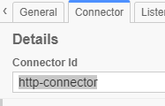

依次设置url，payload，method3个输入参数

*可以使用${}引用变量的值，这里的api_key、map_size为开始运行时输入的变量*

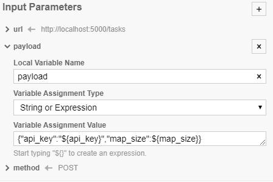

设置输出参数，这里使用Javascript从调用web服务的返回信息里提取信息，并存储在变量中（id，status_code）

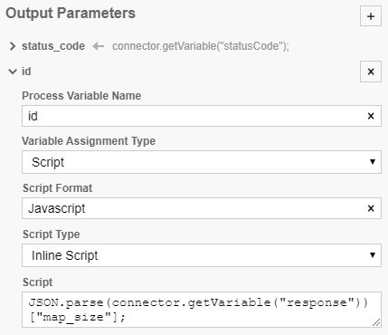

重复以上步骤对每个web服务都创建一个Service Task

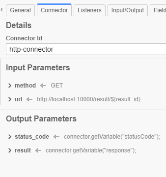

#### 起点，连接，终点

使用箭头从起点开始连接各个Service Task

*被箭头指向的Service Task可以使用之前Service Task输出参数中定义的变量*

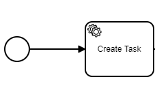

添加终点并连接

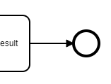

#### User Task
添加一个User Task用于显示最终结果


将其分配给demo用户

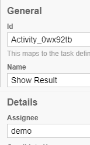

如下图所示添加一个Form Field

*ID对应之前输出的变量名*

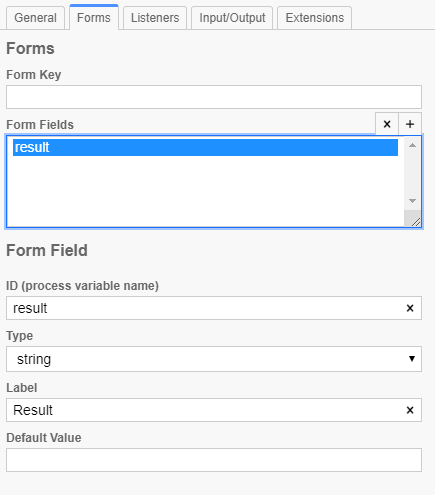

#### gateway
gateway用于根据变量的值做分支。

从左侧添加gateway（菱形）并连线、命名。

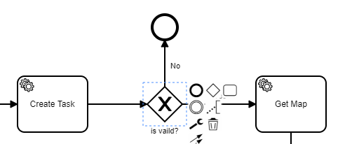

在gateway向后的连线上设置名称和条件

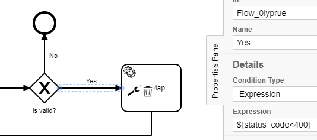

#### BPMN
完成的BPMN如图所示

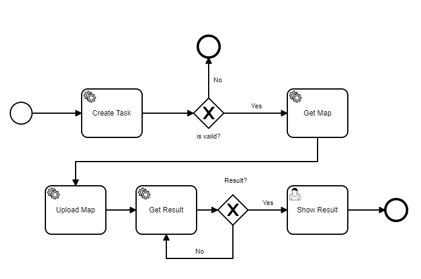

## 实验结果
### 修改场景名称

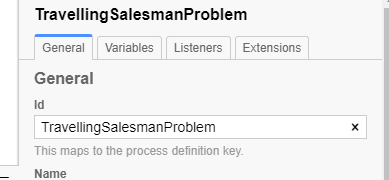

### 部署

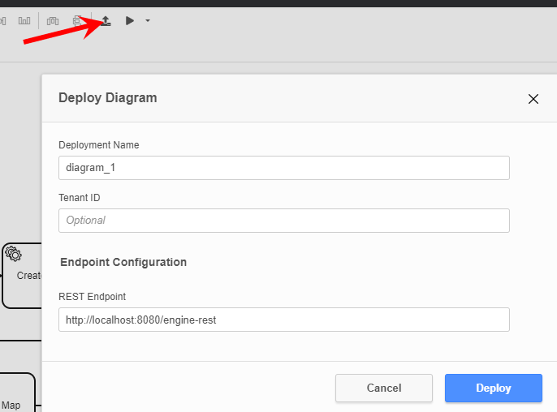

### 发送请求

```bash
curl -X POST -H "Content-Type: application/json" -d '{"variables": {"map_size":{"value":24, "type":"long"},"api_key":{"value":"5WDXCXnIVR"}}}' http://localhost:8080/engine-rest/process-definition/key/TravellingSalesmanProblem/start
```
*也可以使用网页上的start process*

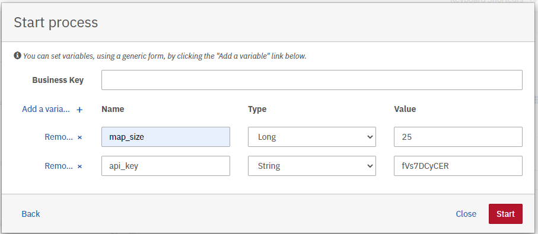

### web服务日志
#### python
```
127.0.0.1 - - [16/Dec/2020 16:47:17] "POST /tasks HTTP/1.1" 201 -
127.0.0.1 - - [16/Dec/2020 16:47:17] "GET /map/25 HTTP/1.1" 200 -
```
#### go
```
127.0.0.1 - - [16/Dec/2020:16:47:17 +0800] "POST /map HTTP/1.1" 200 3628
127.0.0.1 - - [16/Dec/2020:16:47:17 +0800] "GET /result/3 HTTP/1.1" 404 19
127.0.0.1 - - [16/Dec/2020:16:47:18 +0800] "GET /result/3 HTTP/1.1" 404 19
127.0.0.1 - - [16/Dec/2020:16:47:19 +0800] "GET /result/3 HTTP/1.1" 404 19
127.0.0.1 - - [16/Dec/2020:16:47:19 +0800] "GET /result/3 HTTP/1.1" 404 19
127.0.0.1 - - [16/Dec/2020:16:47:20 +0800] "GET /result/3 HTTP/1.1" 404 19
127.0.0.1 - - [16/Dec/2020:16:47:20 +0800] "GET /result/3 HTTP/1.1" 404 19
127.0.0.1 - - [16/Dec/2020:16:47:21 +0800] "GET /result/3 HTTP/1.1" 404 19
127.0.0.1 - - [16/Dec/2020:16:47:21 +0800] "GET /result/3 HTTP/1.1" 404 19
127.0.0.1 - - [16/Dec/2020:16:47:22 +0800] "GET /result/3 HTTP/1.1" 404 19
127.0.0.1 - - [16/Dec/2020:16:47:22 +0800] "GET /result/3 HTTP/1.1" 404 19
127.0.0.1 - - [16/Dec/2020:16:47:23 +0800] "GET /result/3 HTTP/1.1" 404 19
127.0.0.1 - - [16/Dec/2020:16:47:24 +0800] "GET /result/3 HTTP/1.1" 404 19
127.0.0.1 - - [16/Dec/2020:16:47:24 +0800] "GET /result/3 HTTP/1.1" 404 19
127.0.0.1 - - [16/Dec/2020:16:47:25 +0800] "GET /result/3 HTTP/1.1" 404 19
127.0.0.1 - - [16/Dec/2020:16:47:25 +0800] "GET /result/3 HTTP/1.1" 404 19
127.0.0.1 - - [16/Dec/2020:16:47:26 +0800] "GET /result/3 HTTP/1.1" 404 19
127.0.0.1 - - [16/Dec/2020:16:47:26 +0800] "GET /result/3 HTTP/1.1" 200 101
```

### 结果
```json
{
    "id": 3,
    "path": [9,20,8,5,16,0,7,13,22,23,6,4,2,15,21,18,1,10,3,11,14,12,17,19,24],
    "distance": 123067
}
```

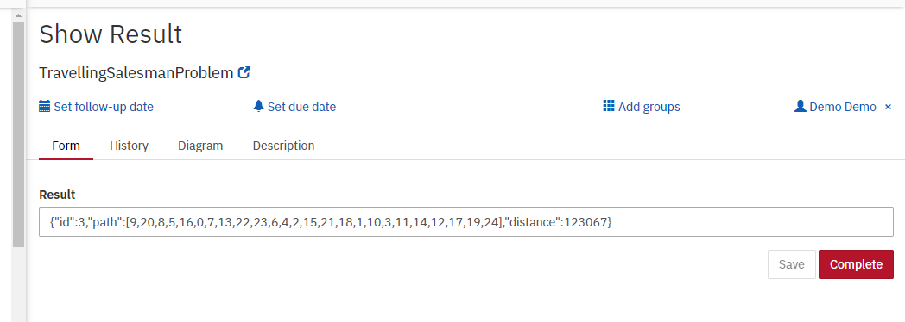