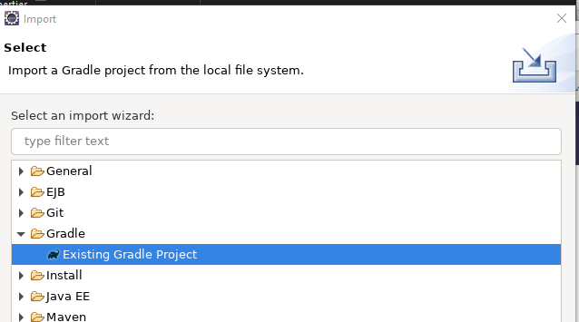
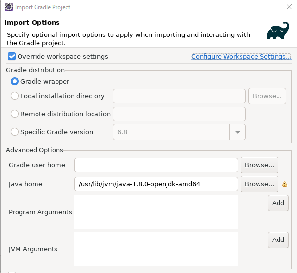
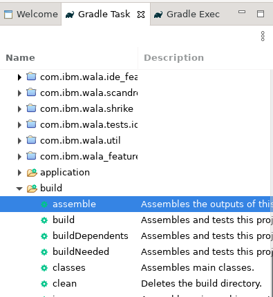
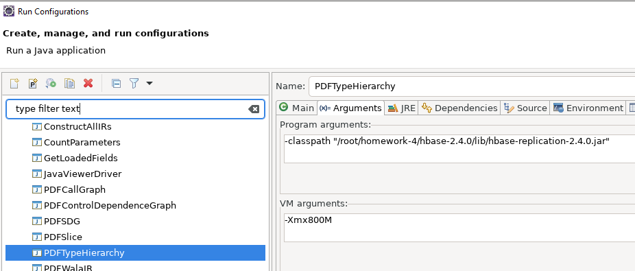
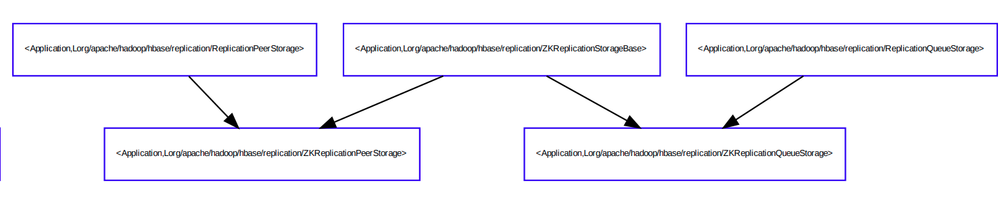
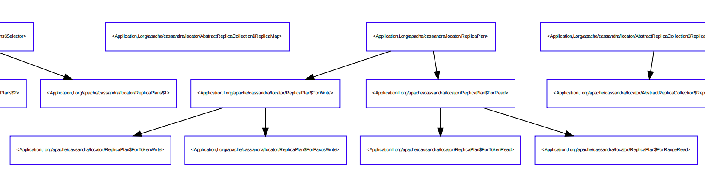

# 代码静态分析1
## 安装
### wala
#### clone
    git clone https://github.com/wala/WALA.git
#### 查看tag
    git tag

    R_1.4.2
    R_1.4.3
    R_1.5.0
    R_1.5.1
    R_1.5.2
    v1.5.3
    v1.5.4
    v1.5.5

#### 使用最新版
    git checkout v1.5.5

### graphviz
    apt install graphviz

### eclipse
#### 下载最新版，解压，运行
    ./eclipse

#### File->Import, 导入Gradle Project


#### 设置项目根目录为WALA
#### 设置JAVA_HOME其他都使用默认值即可


#### 等待Gradle项目导入完成


#### 执行build->assemble任务



## 运行
#### 项目根目录下创建results文件夹，用于存放结果
    mkdir results
#### 在com.ibm.wala.core/src/main/resources下，将复制wala.properties.sample到wala.properties
    cd com.ibm.wala.core/src/main/resources
    cp wala.properties.sample wala.properties

#### 修改wala.properties
    java_runtime_dir = /usr/lib/jvm/java-1.8.0-openjdk-amd64/jre/lib
    output_dir = ../../results

#### 修改com.ibm.wala.core/src/test/resources/wala.examples.properties
这里是pdf阅读器（无桌面版的linux, 没有）和dot（graphviz的组件）的路径。

    dot_exe = /usr/bin/dot

#### 执行build->assemble和ide->eclipse任务


#### 将core、shrike、util设置成项目
通过File->Open Projects From File System依次选择com.ibm.wala.core、com.ibm.wala.shrike、com.ibm.wala.util文件夹

#### 运行com.ibm.wala.core/launchers/PDFTypeHierarchy.launch 
可能会提示找不到jar包，忽略不管。

## 编程
### 修改PDFTypeHierarchy
路径： com.ibm.wala.core/src/main/java/com/ibm/wala/examples/drivers/PDFTypeHierarchy.java

#### 在run函数中统计含有Replica/Replication关键字的类
```java
    int number = 0;
    for (IClass i : cha) {        
        if (scope.isApplicationLoader(i.getClassLoader())) {
            String class_name = i.getName().toString();;
            if (class_name.contains("Replica") || class_name.contains("Replication")) {
                System.out.println(class_name);
                number++;
            }              
        }
    }
    System.out.println("total: "+number);

```

#### 修改typeHierarchy2Graph函数，只构建有关键字类的关系
```java
  private static Boolean isReplica(IClass c) {
    String class_name = c.getName().toString();
    return class_name.contains("Replica") || class_name.contains("Replication");
  }
  /**
   * Return a view of an {@link IClassHierarchy} as a {@link Graph}, with edges from classes to
   * immediate subtypes
   */
  public static Graph<IClass> typeHierarchy2Graph(IClassHierarchy cha) {
    Graph<IClass> result = SlowSparseNumberedGraph.make();
    for (IClass c : cha) {
        if(isReplica(c))
          result.addNode(c);
    }
    for (IClass c : cha) {
      for (IClass x : cha.getImmediateSubclasses(c)) {
        if(isReplica(c)&&isReplica(x))
          result.addEdge(c, x);
      }
      if (c.isInterface()) {
        for (IClass x : cha.getImplementors(c.getReference())) {
          if(isReplica(c)&&isReplica(x))
            result.addEdge(c, x);
        }
      }
    }
    return result;
  }
```

## 结果
### hbase
#### 下载最新hbase版本
最新版本为2.4.0，解压

#### 设置jar路径
jar路径为lib/hbase-replication-2.4.0.jar



#### 运行PDFTypeHierarchy.launch
```
Lorg/apache/hadoop/hbase/replication/ReplicationStorageFactory
Lorg/apache/hadoop/hbase/replication/ReplicationTrackerZKImpl
Lorg/apache/hadoop/hbase/replication/ReplicationPeerStorage
Lorg/apache/hadoop/hbase/replication/ReplicationListener
Lorg/apache/hadoop/hbase/replication/ReplicationTracker
Lorg/apache/hadoop/hbase/replication/ReplicationPeerConfigListener
Lorg/apache/hadoop/hbase/replication/ReplicationQueueStorage
Lorg/apache/hadoop/hbase/replication/ReplicationPeerImpl
Lorg/apache/hadoop/hbase/replication/ReplicationPeer
Lorg/apache/hadoop/hbase/replication/ReplicationFactory
Lorg/apache/hadoop/hbase/replication/ReplicationUtils
Lorg/apache/hadoop/hbase/replication/ZKReplicationStorageBase
Lorg/apache/hadoop/hbase/replication/ReplicationPeer$PeerState
Lorg/apache/hadoop/hbase/replication/ZKReplicationPeerStorage
Lorg/apache/hadoop/hbase/replication/ReplicationPeers
Lorg/apache/hadoop/hbase/replication/ZKReplicationQueueStorage
Lorg/apache/hadoop/hbase/replication/ReplicationQueueInfo
total: 17
```



### cassandra
####  下载最新cassandra的jar包
最新版本为：cassandra-all-4.0-beta4

https://mvnrepository.com/artifact/org.apache.cassandra/cassandra-all/4.0-beta4

#### 设置jar路径
    -classpath "/root/homework-4/cassandra-all-4.0-beta4.jar"

#### 运行PDFTypeHierarchy.launch
```
......

Lorg/apache/cassandra/locator/Replicas
Lorg/apache/cassandra/locator/AbstractReplicationStrategy
Lorg/apache/cassandra/service/reads/ReplicaFilteringProtection$PartitionBuilder$1
Lorg/apache/cassandra/locator/ReplicaLayout$ForRange
Lorg/apache/cassandra/db/lifecycle/LogReplica
Lorg/apache/cassandra/locator/AbstractReplicaCollection$ReplicaMap$EntrySet
total: 69
```



