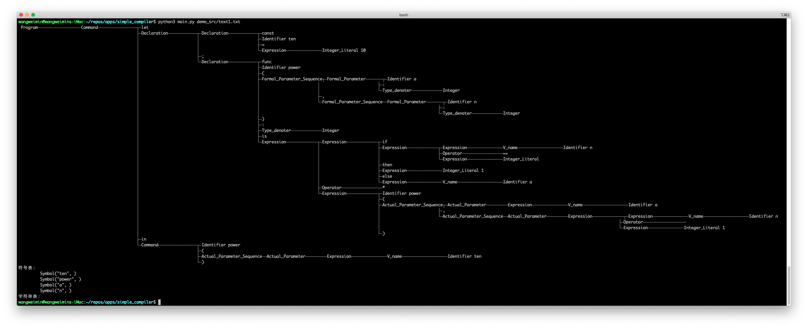
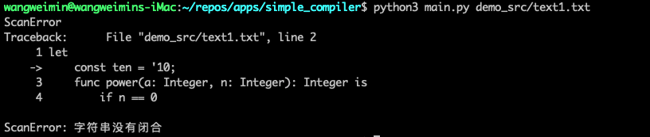
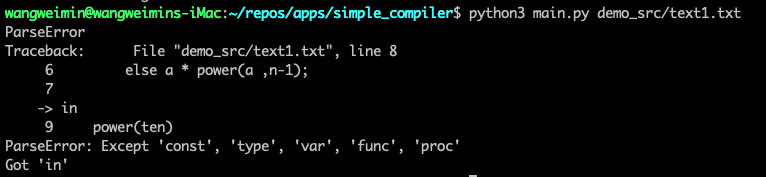

# 类Pascal语言的语法分析器


## 功能
使用Python实现的类Pascal语言的词法分析和语法分析器。

语法分析实现的功能有：
 - 利用文法推导式构造LR(1)分析表
 - 使用LR(1)分析表对输入的Token串进行语法分析，构建语法树
 - 树形输出语法树
 - 词法语法检错，显示出错代码上下文和出错原因

## 程序运行

```
python3 main.py src_path
```
对输入路径为`src_path`的源文件进行语法分析
```
python3 main.py make-parse-table
```
根据 parser/bnf.txt 所定义的语言BNF范式构造语言的LR(1)语法分析表，并将分析表以文件的形式保存到项目目录的`data`文件夹中；

## 运行截图
下面为语法分析器对以下源程序进行语法分析的结果
```pascal
let
    const ten = 10;
    func power(a: Integer, n: Integer): Integer is
        if n == 0
        then 1
        else a * power(a ,n-1)
in
    power(ten)
```
程序语法树构造结果：



源文件存在词法错误时的输出：



源文件存在语法错误时的输出：




